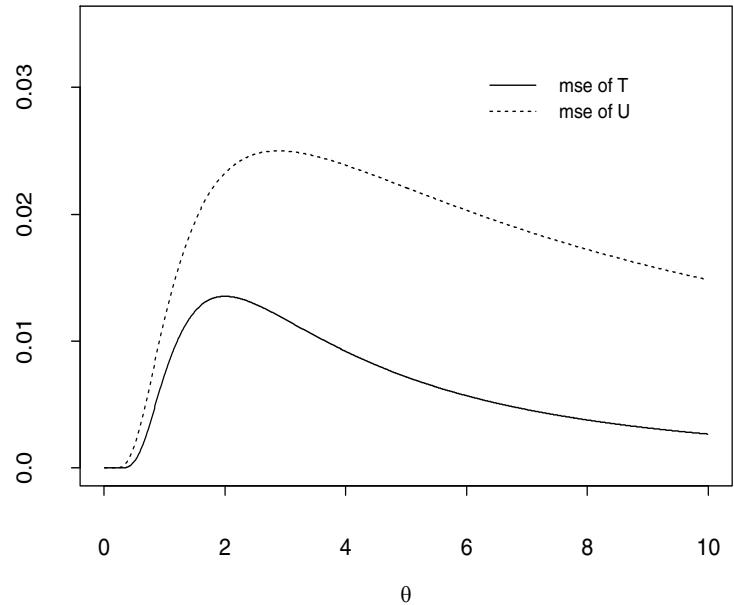
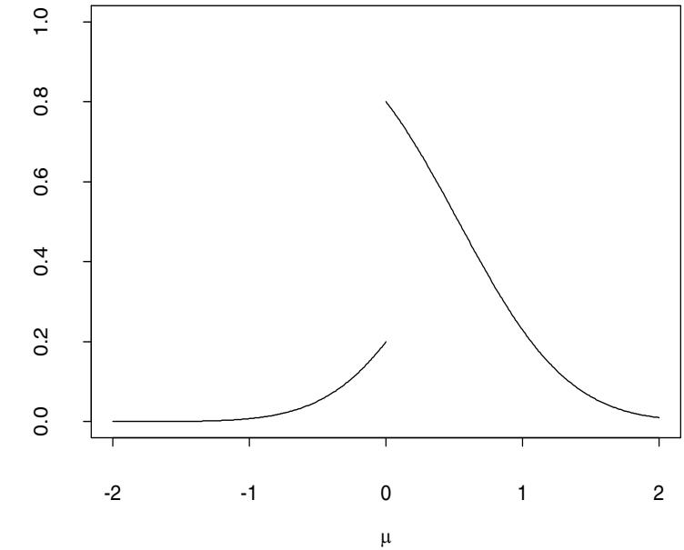
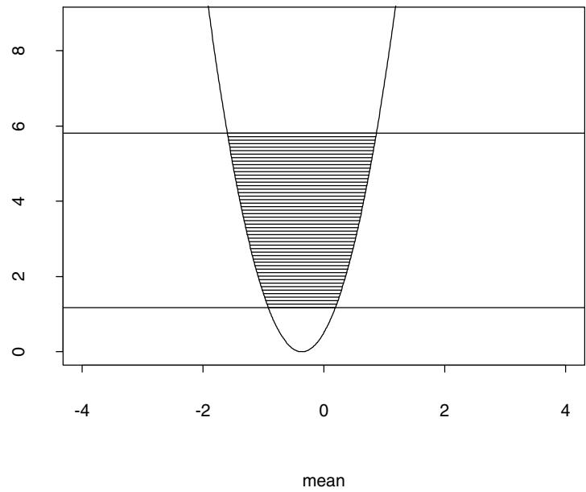

Minimal sufficient statistics exist under weak assumptions, e.g., $\mathcal { P }$ contains distributions on $\mathcal { R } ^ { k }$ dominated by a $\sigma$ -finite measure (Bahadur, 1957). The next theorem provides some useful tools for finding minimal sufficient statistics.

Theorem 2.3. Let $\mathcal { P }$ be a family of distributions on $\mathcal { R } ^ { k }$ .

(i) Suppose that $\mathcal { P } _ { 0 } \subset \mathcal { P }$ and a.s. $\mathcal { P } _ { 0 }$ implies a.s. $\mathcal { P }$ . If $T$ is sufficient for $P \in \mathcal { P }$ and minimal sufficient for $P \in \mathcal { P } _ { 0 }$ , then $T$ is minimal sufficient for $P \in \mathcal { P }$ .

sure. Let (ii) Suppose that $\begin{array} { r } { f _ { \infty } ( x ) = \sum _ { i = 0 } ^ { \infty } c _ { i } f _ { i } ( x ) } \end{array}$ $\mathcal { P }$ contains p.d.f.’s , where $f _ { 0 } , f _ { 1 } , f _ { 2 } , \ldots$ $c _ { i } > 0$ for all , w.r.t. a $i$ and $\sigma$ $\textstyle \sum _ { i = 0 } ^ { \infty } c _ { i } = 1$ -finite mea- , and let $T _ { i } ( X ) ~ = ~ f _ { i } ( x ) / f _ { \infty } ( x )$ when $f _ { \infty } ( x ) \ > \ 0$ , $i = 0 , 1 , 2 , . . .$ . Then $T ( X ) = ( T _ { 0 } , T _ { 1 } , T _ { 2 } , \ldots ) $ is minimal sufficient for $P \in \mathcal { P }$ . Furthermore, if $\{ x : f _ { i } ( x ) > 0 \} \subset \{ x : f _ { 0 } ( x ) > 0 \}$ for all $_ i$ , then we may replace $f _ { \infty }$ by $f _ { 0 }$ , in which case $T ( X ) = ( T _ { 1 } , T _ { 2 } , \ldots )$ is minimal sufficient for $P \in \mathcal { P }$ .

(iii) Suppose that $\mathcal { P }$ contains p.d.f.’s $f _ { P }$ w.r.t. a $\sigma$ -finite measure and that there exists a sufficient statistic $T ( X )$ such that, for any possible values $x$ and $y$ of $X$ , $f _ { \scriptscriptstyle P } ( x ) = f _ { \scriptscriptstyle P } ( y ) \phi ( x , y )$ for all $P$ implies $T ( x ) = T ( y )$ , where $\phi$ is a measurable function. Then $T ( X )$ is minimal sufficient for $P \in \mathcal { P }$ .

Proof. (i) If $S$ is sufficient for $P \in \mathcal { P }$ , then it is also sufficient for $P \in \mathcal { P } _ { 0 }$ and, therefore, $T = \psi ( S )$ a.s. $\mathcal { P } _ { 0 }$ holds for a measurable function $\psi$ . The result follows from the assumption that a.s. $\mathcal { P } _ { 0 }$ implies a.s. $\mathcal { P }$ .

(ii) Note that $f _ { \infty } > 0$ a.s. $\mathcal { P }$ . Let $g _ { i } ( T ) ~ = ~ T _ { i }$ , $i = 0 , 1 , 2 , \ldots$ . Then $f _ { i } ( x ) = g _ { i } ( T ( x ) ) f _ { \infty } ( x )$ a.s. $\mathcal { P }$ . By Theorem 2.2, $T$ is sufficient for $P \in \mathcal { P }$ . Suppose that $S ( X )$ is another sufficient statistic. By Theorem 2.2, there are Borel functions $h$ and $\ddot { g } _ { i }$ such that $f _ { i } ( x ) = \tilde { g } _ { i } ( S ( x ) ) h ( x )$ , $i = 0 , 1 , 2 , \ldots$ Then $\begin{array} { r } { T _ { i } ( x ) = { \tilde { g } _ { i } } ( S ( x ) ) / \sum _ { j = 0 } ^ { \infty } c _ { j } \tilde { g } _ { j } ( S ( x ) ) } \end{array}$ for $x$ ’s satisfying $f _ { \infty } ( x ) > 0$ . By Definition 2.5, $T$ is minimal sufficient for $P \in \mathcal { P }$ . The proof for the case where $f _ { \infty }$ is replaced by $f _ { 0 }$ is the same.

(iii) From Bahadur (1957), there exists a minimal sufficient statistic $S ( X )$ . The result follows if we can show that $T ( X ) = \psi ( S ( X ) )$ a.s. $\mathcal { P }$ for a measurable function $\psi$ . By Theorem 2.2, there are Borel functions $g _ { P }$ and $h$ such that $f _ { \scriptscriptstyle P } ( x ) = g _ { \scriptscriptstyle P } ( S ( x ) ) h ( x )$ for all $P$ . Let $A = \{ x : h ( x ) = 0 \}$ . Then $P ( A ) = 0$ for all $P$ . For $x$ and $y$ such that $S ( x ) = S ( y )$ , $x \not \in A$ and $y \not \in A$ ,

$$
\begin{array} { l } { f _ { P } ( x ) = g _ { P } ( S ( x ) ) h ( x ) \qquad } \\ { \qquad = g _ { P } ( S ( y ) ) h ( x ) h ( y ) / h ( y ) \qquad } \\ { \qquad = f _ { P } ( y ) h ( x ) / h ( y ) \qquad } \end{array}
$$

for all $P$ . Hence $T ( x ) = T ( y )$ . This shows that there is a function $\psi$ such that $T ( x ) \ = \ \psi ( S ( x ) )$ except for $x \in A$ . It remains to show that $\psi$ is measurable. Since $S$ is minimal sufficient, $g ( T ( X ) ) = S ( X )$ a.s. $\mathcal { P }$ for a measurable function $g$ . Hence $g$ is one-to-one and $\psi = g ^ { - 1 }$ . The measurability of $\psi$ follows from Theorem 3.9 in Parthasarathy (1967).

Example 2.14. Let $\mathcal { P } = \{ f _ { \theta } : \theta \in \Theta \}$ be an exponential family with p.d.f.’s $f _ { \theta }$ given by (2.4) and $X ( \omega ) = \omega$ . Suppose that there exists $\Theta _ { 0 } =$ $\{ \theta _ { 0 } , \theta _ { 1 } , . . . , \theta _ { p } \} \subset \Theta$ such that the vectors $\eta _ { i } = \eta ( \theta _ { i } ) - \eta ( \theta _ { 0 } )$ , $i = 1 , . . . , p$ , are linearly independent in $\mathcal { R } ^ { p }$ . (This is true if the family is of full rank.) We have shown that $T ( X )$ is sufficient for $\theta \in \Theta$ . We now show that $T$ is in fact minimal sufficient for $\theta \in \Theta$ . Let $\mathcal { P } _ { 0 } = \{ f _ { \theta } : \theta \in \Theta _ { 0 } \}$ . Note that the set $\{ x : f _ { \theta } ( x ) > 0 \}$ does not depend on $\theta$ . It follows from Theorem 2.3(ii) with $f _ { \infty } = f _ { \theta _ { 0 } }$ that

$$
S ( X ) = \left( \exp \{ \eta _ { 1 } ^ { \tau } T ( x ) - \xi _ { 1 } \} , . . . , \exp \{ \eta _ { p } ^ { \tau } T ( x ) - \xi _ { p } \} \right)
$$

is minimal sufficient for $\theta \in \Theta _ { 0 }$ , where $\xi _ { i } = \xi ( \theta _ { i } ) - \xi ( \theta _ { 0 } )$ . Since $\eta _ { i }$ ’s are linearly independent, there is a one-to-one measurable function $\psi$ such that $T ( X ) = \psi ( S ( X ) )$ a.s. $\mathcal { P } _ { 0 }$ . Hence, $T$ is minimal sufficient for $\theta \in \Theta _ { 0 }$ . It is easy to see that a.s. $\mathcal { P } _ { 0 }$ implies a.s. $\mathcal { P }$ . Thus, by Theorem 2.3(i), $T$ is minimal sufficient for $\theta \in \Theta$ .

The results in Examples 2.13 and 2.14 can also be proved by using Theorem 2.3(iii) (Exercise 32).

The sufficiency (and minimal sufficiency) depends on the postulated family $\mathcal { P }$ of populations (statistical models). Hence, it may not be a useful concept if the proposed statistical model is wrong or at least one has some doubts about the correctness of the proposed model. From the examples in this section and some exercises in $\mathrm { \ddot { 9 } 2 . 6 }$ , one can find that for a wide variety of models, statistics such as $X$ in (2.1), $S ^ { 2 }$ in (2.2), $( X _ { ( 1 ) } , X _ { ( n ) } )$ in Example 2.11, and the order statistics in Example 2.9 are sufficient. Thus, using these statistics for data reduction and summarization does not lose any information when the true model is one of those models but we do not know exactly which model is correct.

# 2.2.3 Complete statistics

A statistic $V ( X )$ is said to be ancillary if its distribution does not depend on the population $P$ and first-order ancillary if $E [ V ( X ) ]$ is independent of $P$ . A trivial ancillary statistic is the constant statistic $V ( X ) \equiv c \in$ $\mathcal { R }$ . If $V ( X )$ is a nontrivial ancillary statistic, then $\sigma ( V ( X ) ) \subset \sigma ( X )$ is a nontrivial $\sigma$ -field that does not contain any information about $P$ . Hence, if $S ( X )$ is a statistic and $V ( S ( X ) )$ is a nontrivial ancillary statistic, it indicates that $\sigma ( S ( X ) )$ contains a nontrivial $\sigma$ -field that does not contain any information about $P$ and, hence, the “data” $S ( X )$ may be further reduced. A sufficient statistic $T$ appears to be most successful in reducing the data if no nonconstant function of $T$ is ancillary or even first-order ancillary. This leads to the following concept of completeness.

Definition 2.6 (Completeness). A statistic $T ( X )$ is said to be complete for $P \in \mathcal { P }$ if and only if, for any Borel $f$ , $E [ f ( T ) ] = 0$ for all $P \in \mathcal { P }$ implies $f ( T ) = 0$ a.s. $\mathcal { P }$ . $T$ is said to be boundedly complete if and only if the previous statement holds for any bounded Borel $f$ .

A complete statistic is boundedly complete. If $T$ is complete (or boundedly complete) and $S = \psi ( T )$ for a measurable $\psi$ , then $S$ is complete (or boundedly complete). Intuitively, a complete and sufficient statistic should be minimal sufficient, which was shown by Lehmann and Scheff´e (1950) and Bahadur (1957) (see Exercise 48). However, a minimal sufficient statistic is not necessarily complete; for example, the minimal sufficient statistic $( X _ { ( 1 ) } , X _ { ( n ) } )$ in Example 2.13 is not complete (Exercise 47).

Proposition 2.1. If $P$ is in an exponential family of full rank with p.d.f.’s given by (2.6), then $T ( X )$ is complete and sufficient for $\eta \in \Xi$ .

Proof. We have shown that $T$ is sufficient. Suppose that there is a function $f$ such that $E [ f ( T ) ] = 0$ for all $\eta \in \Xi$ . By Theorem 2.1(i),

$$
\int f ( t ) \exp \{ \eta ^ { \tau } t - \zeta ( \eta ) \} d \lambda = 0 \quad \mathrm { f o r ~ a l l ~ } \eta \in \Xi ,
$$

where $\lambda$ is a measure on $( \mathcal { R } ^ { p } , \mathcal { B } ^ { p } )$ . Let $\eta _ { 0 }$ be an interior point of $\Xi$ . Then

$$
\int f _ { + } ( t ) e ^ { \eta ^ { \tau } t } d \lambda = \int f _ { - } ( t ) e ^ { \eta ^ { \tau } t } d \lambda \quad \mathrm { f o r ~ a l l ~ } \eta \in N ( \eta _ { 0 } ) ,
$$

where $N ( \eta _ { 0 } ) = \{ \eta \in \mathcal { R } ^ { p } : \| \eta - \eta _ { 0 } \| < \epsilon \}$ for some $\epsilon > 0$ . In particular,

$$
\int f _ { + } ( t ) e ^ { \eta _ { 0 } ^ { \tau } t } d \lambda = \int f _ { - } ( t ) e ^ { \eta _ { 0 } ^ { \tau } t } d \lambda = c .
$$

If $c = 0$ , then $f = 0$ a.e. $\lambda$ . If $c > 0$ , then $c ^ { - 1 } f _ { + } ( t ) e ^ { \eta _ { 0 } ^ { \prime } t }$ and $c ^ { - 1 } f _ { - } ( t ) e ^ { \eta _ { 0 } ^ { \prime } t }$ are p.d.f.’s w.r.t. $\lambda$ and (2.16) implies that their m.g.f.’s are the same in a neighborhood of $0$ . By Theorem 1.6(ii), $c ^ { - 1 } f _ { + } ( t ) e ^ { \eta _ { 0 } ^ { \tau } t } = c ^ { - 1 } f _ { - } ( t ) e ^ { \eta _ { 0 } ^ { \tau } t }$ , i.e., $f = f _ { + } - f _ { - } = 0$ a.e. $\lambda$ . Hence $T$ is complete.

Proposition 2.1 is useful for finding a complete and sufficient statistic when the family of distributions is an exponential family of full rank.

Example 2.15. Suppose that $X _ { 1 } , . . . , X _ { n }$ are i.i.d. random variables having the $N ( \mu , \sigma ^ { 2 } )$ distribution, $\mu \in \mathcal { R }$ , $\sigma > 0$ . From Example 2.6, the joint p.d.f. of $\begin{array} { r } { T _ { 2 } ~ = ~ - \sum _ { i = 1 } ^ { n } X _ { i } ^ { 2 } } \end{array}$ $X _ { 1 } , . . . , X _ { n }$ is $( 2 \pi ) ^ { - n / 2 } \exp { \left\{ \eta _ { 1 } T _ { 1 } + \eta _ { 2 } T _ { 2 } - n \zeta ( \eta ) \right\} }$ , and $\begin{array} { r } { \eta = ( \eta _ { 1 } , \eta _ { 2 } ) = \left( \frac { \mu } { \sigma ^ { 2 } } , \frac { 1 } { 2 \sigma ^ { 2 } } \right) } \end{array}$ } 1  i=1 i. Hence, the family of , where $\begin{array} { r } { T _ { 1 } = \sum _ { i = 1 } ^ { n } X _ { i } } \end{array}$ , distributions for $\boldsymbol { X } = ( X _ { 1 } , . . . , X _ { n } )$ is a natural exponential family of full rank $\Xi = \mathcal { R } \times ( 0 , \infty ) )$ . By Proposition 2.1, $T ( X ) = ( T _ { 1 } , T _ { 2 } )$ is complete and sufficient for $\eta$ . Since there is a one-to-one correspondence between $\eta$ and $\theta = \left( \mu , \sigma ^ { 2 } \right)$ , $T$ is also complete and sufficient for $\theta$ . It can be shown that any one-to-one measurable function of a complete and sufficient statistic is also complete and sufficient (exercise). Thus, $( X , S ^ { 2 } )$ is complete and sufficient for $\theta$ , where $X$ and $S ^ { 2 }$ are the sample mean and variance given by (2.1) and (2.2), respectively. ■

The following examples show how to find a complete statistic for a nonexponential family.

Example 2.16. Let $X _ { 1 } , . . . , X _ { n }$ be i.i.d. random variables from $P _ { \theta }$ , the uniform distribution $U ( 0 , \theta )$ , $\theta > 0$ . The largest order statistic, $X _ { ( n ) }$ , is complete and sufficient for $\theta \in ( 0 , \infty )$ . The sufficiency of $X _ { ( n ) }$ follows from the fact that the joint Lebesgue p.d.f. of $X _ { 1 } , . . . , X _ { n }$ is $\theta ^ { - n } I _ { ( 0 , \theta ) } ( x _ { ( n ) } )$ . From Example 2.9, $X _ { ( n ) }$ has the Lebesgue p.d.f. $( n x ^ { n - 1 } / \theta ^ { n } ) I _ { ( 0 , \theta ) } ( x )$ on $\mathcal { R }$ . Let $f$ be a Borel function on $[ 0 , \infty )$ such that $E [ f ( X _ { ( n ) } ) ] = 0$ for all $\theta > 0$ . Then

$$
\int _ { 0 } ^ { \theta } f ( x ) x ^ { n - 1 } d x = 0 { \mathrm { ~ f o r ~ a l l ~ } } \theta > 0 .
$$

Let $G ( \theta )$ be the left-hand side of the previous equation. Applying the result of differentiation of an integral (see, e.g., Royden (1968, 5.3)), we obtain that $G ^ { \prime } ( \theta ) ~ = ~ f ( \theta ) \theta ^ { n - 1 }$ a.e. $m _ { + }$ , where $m _ { + }$ is the Lebesgue measure on $( [ 0 , \infty ) , B _ { [ 0 , \infty ) } )$ ). Since $G ( \theta ) = 0$ for all $\theta > 0$ , $f ( \theta ) \theta ^ { n - 1 } = 0$ a.e. $m _ { + }$ and, hence, $f ( x ) = 0$ a.e. $m _ { + }$ . Therefore, $X _ { ( n ) }$ is complete and sufficient for $\theta \in ( 0 , \infty )$ .

Example 2.17. In Example 2.12, we showed that the order statistics $T ( X ) = ( X _ { ( 1 ) } , . . . , X _ { ( n ) } )$ of i.i.d. random variables $X _ { 1 } , . . . , X _ { n }$ is sufficient for $P \in \mathcal { P }$ , where $\mathcal { P }$ is the family of distributions on $\mathcal { R }$ having Lebesgue p.d.f.’s. We now show that $T ( X )$ is also complete for $P \in \mathcal { P }$ . Let $\mathcal { P } _ { 0 }$ be the family of Lebesgue p.d.f.’s of the form

$$
f ( x ) = C ( \theta _ { 1 } , . . . , \theta _ { n } ) \exp \{ - x ^ { 2 n } + \theta _ { 1 } x + \theta _ { 2 } x ^ { 2 } + \cdot \cdot \cdot + \theta _ { n } x ^ { n } \} ,
$$

where $\theta _ { j } \in \mathcal { R }$ and $C ( \theta _ { 1 } , . . . , \theta _ { n } )$ is a normalizing constant such that $\textit { j f } ( x ) d x$ $= 1$ . Then $\mathcal { P } _ { 0 } \subset \mathcal { P }$ and $\mathcal { P } _ { 0 }$ is an exponential family of full rank. Note that the joint distribution of $X = ( X _ { 1 } , . . . , X _ { n } )$ is also in an exponential family of full rank. Thus, by Proposition 2.1, $U = ( U _ { 1 } , . . . , U _ { n } )$ is a complete statistic for $P \in \mathcal { P } _ { 0 }$ , where $\begin{array} { r } { U _ { j } = \sum _ { i = 1 } ^ { n } X _ { i } ^ { \ j } } \end{array}$ . Since a.s. $\mathcal { P } _ { 0 }$ implies a.s. $\mathcal { P }$ , $U ( X )$ is also complete for $P \in \mathcal { P }$ .

The result follows if we can show that there is a one-to-one correspondence between $T ( X )$ and $U ( X )$ . Let $\begin{array} { r } { V _ { 1 } = \sum _ { i = 1 } ^ { n } X _ { i } } \end{array}$ , $\begin{array} { r } { V _ { 2 } = \sum _ { i < j } X _ { i } X _ { j } } \end{array}$ $\begin{array} { r } { V _ { 3 } = \sum _ { i < j < k } X _ { i } X _ { j } X _ { k } , \dots } \end{array}$ , $V _ { n } = X _ { 1 } \cdots X _ { n }$ . From the identities

$$
U _ { k } - V _ { 1 } U _ { k - 1 } + V _ { 2 } U _ { k - 2 } - \cdot \cdot \cdot + ( - 1 ) ^ { k - 1 } V _ { k - 1 } U _ { 1 } + ( - 1 ) ^ { k } k V _ { k } = 0 ,
$$

$k \ = \ 1 , . . . , n$ , there is a one-to-one correspondence between $U ( X )$ and $V ( X ) = ( V _ { 1 } , . . . , V _ { n } )$ . From the identity

$$
( t - X _ { 1 } ) \cdot \cdot \cdot ( t - X _ { n } ) = t ^ { n } - V _ { 1 } t ^ { n - 1 } + V _ { 2 } t ^ { n - 2 } - \cdot \cdot \cdot + ( - 1 ) ^ { n } V _ { n } ,
$$

there is a one-to-one correspondence between $V ( X )$ and $T ( X )$ . This completes the proof and, hence, $T ( X )$ is sufficient and complete for $P \in \mathcal { P }$ . In fact, both $U ( X )$ and $V ( X )$ are sufficient and complete for $P \in \mathcal { P }$ .

The relationship between an ancillary statistic and a complete and sufficient statistic is characterized in the following result.

Theorem 2.4 (Basu’s theorem). Let $V$ and $T$ be two statistics of $X$ from a population $P \in \mathcal { P }$ . If $V$ is ancillary and $T$ is boundedly complete and sufficient for $P \in \mathcal { P }$ , then $V$ and $T$ are independent w.r.t. any $P \in \mathcal { P }$ .

Proof. Let $B$ be an event on the range of $V$ . Since $V$ is ancillary, $P ( V ^ { - 1 } ( B ) )$ is a constant. Since $T$ is sufficient, $E [ I _ { B } ( V ) | T ]$ is a function of $T$ (independent of $P$ ). Since $E \{ E [ I _ { B } ( V ) | T ] - P ( V ^ { - 1 } ( B ) ) \} = 0$ for all $P \in \mathcal { P }$ , $P ( V ^ { - 1 } ( B ) | T ) = E [ I _ { B } ( V ) | T ] = P ( V ^ { - 1 } ( B ) )$ a.s. $\mathcal { P }$ , by the bounded completeness of $T$ . Let $A$ be an event on the range of $T$ . Then, P $^ { \circ } ( T ^ { - 1 } ( A ) \cap V ^ { - 1 } ( B ) ) = E \{ E [ I _ { A } ( T ) I _ { B } ( V ) | T ] \} = E \{ I _ { A } ( T ) E [ I _ { B } ( V ) | T ] \} =$ $E \{ I _ { A } ( T ) P ( V ^ { - 1 } ( B ) ) \} = P ( T ^ { - 1 } ( A ) ) P ( V ^ { - 1 } ( B ) )$ . Hence $T$ and $V$ are independent w.r.t. any $P \in \mathcal { P }$ . $-$

Basu’s theorem is useful in proving the independence of two statistics.

Example 2.18. Suppose that $X _ { 1 } , . . . , X _ { n }$ are i.i.d. random variables having the $N ( \mu , \sigma ^ { 2 } )$ distribution, with $\mu \in \mathcal { R }$ and a known $\sigma > 0$ . It can be easily shown that the family $\{ N ( \mu , \sigma ^ { 2 } ) : \mu \in \mathcal { R } \}$ is an exponential family of full rank with natural parameter $\eta = \mu / \sigma ^ { 2 }$ . By Proposition 2.1, the sample mean $X$ in (2.1) is complete and sufficient for $\eta$ (and $\mu$ ). Let $S ^ { 2 }$ be the anis by ( and $S ^ { 2 } = ( n - 1 ) ^ { - 1 } \textstyle \sum _ { i = 1 } ^ { n } ( Z _ { i } - Z ) ^ { 2 }$ , whstic ( $Z _ { i } = X _ { i } - \mu$ $N ( 0 , \sigma ^ { 2 } )$ $Z = n _ { - } ^ { - 1 } \sum _ { i = 1 } ^ { n } Z _ { i }$ $S ^ { 2 }$ $\sigma ^ { 2 }$ is known). By Basu’s theorem, $X$ and $S ^ { 2 }$ are independent w.r.t. $N ( \mu , \sigma ^ { 2 } )$ with $\mu \in \mathcal { R }$ . Since $\sigma ^ { 2 }$ is arbitrary, $X$ and $S ^ { 2 }$ are independent w.r.t. $N ( \mu , \sigma ^ { 2 } )$ for any $\mu \in \mathcal { R }$ and $\sigma ^ { 2 } > 0$ .

Using the independence of $X$ and $S ^ { 2 }$ , we now show that $( n - 1 ) S ^ { 2 } / \sigma ^ { 2 }$ has the chi-square distribution $\chi _ { n - 1 } ^ { 2 }$ . Note that

$$
n \left( { \frac { { \bar { X } } - \mu } { \sigma } } \right) ^ { 2 } + { \frac { ( n - 1 ) S ^ { 2 } } { \sigma ^ { 2 } } } = \sum _ { i = 1 } ^ { n } \left( { \frac { X _ { i } - \mu } { \sigma } } \right) ^ { 2 } .
$$

From the properties of the normal distributions, $n ( X - \mu ) ^ { 2 } / \sigma ^ { 2 }$ has the chisquare distribution $\chi _ { 1 } ^ { 2 }$ with the m.g.f. $( 1 - 2 t ) ^ { - 1 / 2 }$ −and $\scriptstyle \sum _ { i = 1 } ^ { n } ( X _ { i } - \mu ) ^ { 2 } / \sigma ^ { 2 }$

has the chi-square distribution $\chi _ { n } ^ { 2 }$ with the m.g.f. $( 1 - 2 t ) ^ { - n / 2 }$ , $t < 1 / 2$ . By the independence of $X$ and $S ^ { 2 }$ , the m.g.f. of $( n - 1 ) S ^ { 2 } / \sigma ^ { 2 }$ is

$$
( 1 - 2 t ) ^ { - n / 2 } / ( 1 - 2 t ) ^ { - 1 / 2 } = ( 1 - 2 t ) ^ { - ( n - 1 ) / 2 }
$$

for $t < 1 / 2$ . This is the m.g.f. of the chi-square distribution $\chi _ { n - 1 } ^ { 2 }$ and, therefore, the result follows.

# 2.3 Statistical Decision Theory

In this section, we describe some basic elements in statistical decision theory. More developments are given in later chapters.

# 2.3.1 Decision rules, loss functions, and risks

Let $X$ be a sample from a population $P \in \mathcal { P }$ . A statistical decision is an action that we take after we observe $X$ , for example, a conclusion about $P$ or a characteristic of $P$ . Throughout this section, we use A to denote the set of allowable actions. Let $\mathcal { F } _ { \mathbb { A } }$ be a $\sigma$ -field on A. Then the measurable space $( \mathbb { A } , \mathcal { F } _ { \mathbb { A } } )$ is called the action space. Let $_ { x }$ be the range of $X$ and $\mathcal { F } _ { \mathcal { X } }$ be a $\sigma$ -field on $_ { x }$ . A decision rule is a measurable function (a statistic) $T$ from $( x , \mathcal { F } _ { \mathcal { X } } )$ to $( \mathbb { A } , \mathcal { F } _ { \mathbb { A } } )$ . If a decision rule $T$ is chosen, then we take the action $T ( X ) \in \mathbb { A }$ whence $X$ is observed.

The construction or selection of decision rules cannot be done without any criterion about the performance of decision rules. In statistical decision theory, we set a criterion using a loss function $L$ , which is a function from $\mathcal { P } \times \mathbb { A }$ to $[ 0 , \infty )$ and is Borel on $( \mathbb { A } , \mathcal { F } _ { \mathbb { A } } )$ for each fixed $P \in \mathcal { P }$ . If $X = x$ is observed and our decision rule is $T$ , then our “loss” (in making a decision) is $L ( P , T ( x ) )$ . The average loss for the decision rule $T$ , which is called the $r i s k$ of $T$ , is defined to be

$$
R _ { T } ( P ) = E [ L ( P , T ( X ) ) ] = \int _ { \mathcal { X } } L ( P , T ( x ) ) d P _ { X } ( x ) .
$$

The loss and risk functions are denoted by $L ( \theta , a )$ and $R _ { T } ( \theta )$ if $\mathcal { P }$ is a parametric family indexed by $\theta$ . A decision rule with small loss is preferred. But it is difficult to compare $L ( P , T _ { 1 } ( X ) )$ and $L ( P , T _ { 2 } ( X ) )$ for two decision rules, $T _ { 1 }$ and $T _ { 2 }$ , since both of them are random. For this reason, the risk function (2.17) is introduced and we compare two decision rules by comparing their risks. A rule $T _ { 1 }$ is as good as another rule $T _ { 2 }$ if and only if

$$
R _ { T _ { 1 } } ( P ) \leq R _ { T _ { 2 } } ( P ) \quad \mathrm { f o r ~ a n y ~ } P \in \mathcal P ,
$$

and is better than $T _ { 2 }$ if and only if (2.18) holds and $R _ { T _ { 1 } } ( P ) < R _ { T _ { 2 } } ( P )$ for at least one $P \in \mathcal { P }$ . Two decision rules $T _ { 1 }$ and $T _ { 2 }$ are equivalent if and only if $R _ { T _ { 1 } } ( P ) = R _ { T _ { 2 } } ( P )$ for all $P \in \mathcal { P }$ . If there is a decision rule $T _ { * }$ that is as good as any other rule in $\Im$ , a class of allowable decision rules, then $T _ { * }$ is said to be $\Im$ -optimal (or optimal if $\Im$ contains all possible rules).

Example 2.19. Consider the measurement problem in Example 2.1. Suppose that we need a decision on the value of $\theta \in \mathcal { R }$ , based on the sample $\boldsymbol { X } = ( X _ { 1 } , . . . , X _ { n } )$ . If $\Theta$ is all possible values of $\theta$ , then it is reasonable to consider the action space $( \mathbb { A } , \mathcal { F } _ { \mathbb { A } } ) = ( \Theta , B _ { \Theta } )$ . An example of a decision rule is $T ( X ) = X$ , the sample mean defined by (2.1). A common loss function in this problem is the squared error loss $L ( P , a ) = ( \theta - a ) ^ { 2 }$ , $a \in \mathbb { A }$ . Then the loss for the decision rule $X$ is the squared deviation between $X$ and $\theta$ . Assuming that the population has mean $\mu$ and variance $\sigma ^ { 2 } < \infty$ , we obtain the following risk function for $X$ :

$$
\begin{array} { r l } & { R _ { \bar { X } } ( P ) = E ( \theta - \bar { X } ) ^ { 2 } } \\ & { \qquad = ( \theta - E \bar { X } ) ^ { 2 } + E ( E \bar { X } - \bar { X } ) ^ { 2 } } \\ & { \qquad = ( \theta - E \bar { X } ) ^ { 2 } + \operatorname { V a r } ( \bar { X } ) } \\ & { \qquad = ( \mu - \theta ) ^ { 2 } + \frac { \sigma ^ { 2 } } { n } , } \end{array}
$$

where result (2.20) follows from the results for the moments of $X$ in Example 2.8. If $\theta$ is in fact the mean of the population, then the first term on the right-hand side of $( 2 . 2 0 )$ is $0$ and the risk is an increasing function of the population variance $\sigma ^ { 2 }$ and a decreasing function of the sample size $n$ .

Consider another decision rule $T _ { 1 } ( X ) = ( X _ { ( 1 ) } + X _ { ( n ) } ) / 2$ . However, $R _ { T _ { 1 } } ( P )$ does not have an explicit form if there is no further assumption on the population $P$ . Suppose that $P \in \mathcal { P }$ . Then, for some $\mathcal { P }$ , $X$ (or $T _ { 1 }$ ) is better than $T _ { 1 }$ (or $X$ ) (exercise), whereas for some $\mathcal { P }$ , neither $\bar { X }$ nor $T _ { 1 }$ is better than the other.

A different loss function may also be considered. For example, $L ( P , a ) =$ $| \theta - a |$ , which is called the absolute error loss. However, $R _ { \bar { X } } ( P )$ and $R _ { T _ { 1 } } ( P )$ do not have explicit forms unless $\mathcal { P }$ is of some specific form. ■

The problem in Example 2.19 is a special case of a general problem called estimation, in which the action space is the set of all possible values of a population characteristic $\vartheta$ to be estimated. In an estimation problem, a decision rule $T$ is called an estimator and result (2.19) holds with $\theta = \vartheta$ and $X$ replaced by any estimator with a finite variance. The following example describes another type of important problem called hypothesis testing.

Example 2.20. Let $\mathcal { P }$ be a family of distributions, $\mathcal { P } _ { 0 } \subset \mathcal { P }$ , and $\mathcal { P } _ { 1 } =$ $\{ P \in \mathcal { P } : P \not \in \mathcal { P } _ { 0 } \}$ . A hypothesis testing problem can be formulated as that of deciding which of the following two statements is true:

$$
H _ { 0 } : \mathrm { ~ } P \in \mathcal { P } _ { 0 } \qquad \mathrm { v e r s u s } \qquad H _ { 1 } : \mathrm { ~ } P \in \mathcal { P } _ { 1 } .
$$

Here, $H _ { 0 }$ is called the null hypothesis and $H _ { 1 }$ is called the alternative hypothesis. The action space for this problem contains only two elements, i.e., $\mathbb { A } = \{ 0 , 1 \}$ , where $0$ is the action of accepting $H _ { 0 }$ and $^ { 1 }$ is the action of rejecting $H _ { 0 }$ . A decision rule is called a test. Since a test $T ( X )$ is a function from $_ { x }$ to $\{ 0 , 1 \}$ , $T ( X )$ must have the form $I _ { C } ( X )$ , where $C \in \mathcal { F } _ { \mathcal { X } }$ is called the rejection region or critical region for testing $H _ { 0 }$ versus $H _ { 1 }$ .

A simple loss function for this problem is the 0-1 loss: $L ( P , a ) = 0$ if a correct decision is made and $1$ if an incorrect decision is made, i.e., $L ( P , j ) = 0$ for $P \in { \mathcal { P } } _ { j }$ and $L ( P , j ) = 1$ otherwise, $j = 0 , 1$ . Under this loss, the risk is

$$
R _ { T } ( P ) = \left\{ \begin{array} { l l } { P ( T ( X ) = 1 ) = P ( X \in C ) } & { \quad P \in \mathcal { P } _ { 0 } } \\ { P ( T ( X ) = 0 ) = P ( X \notin C ) } & { \quad P \in \mathcal { P } _ { 1 } . } \end{array} \right.
$$

See Figure 2.2 on page 127 for an example of a graph of $R _ { T } ( \theta )$ for some $T$ and $P$ in a parametric family.

The 0-1 loss implies that the loss for two types of incorrect decisions (accepting $H _ { 0 }$ when $P \in { \mathcal { P } } _ { 1 }$ and rejecting $H _ { 0 }$ when $P \in \mathcal { P } _ { 0 }$ ) are the same. In some cases, one might assume unequal losses: $L ( P , j ) = 0$ for $P \in { \mathcal { P } } _ { j }$ , $L ( P , 0 ) = c _ { 0 }$ when $P \in { \mathcal { P } } _ { 1 }$ , and $L ( P , 1 ) = c _ { 1 }$ when $P \in \mathcal { P } _ { 0 }$ .

In the following example the decision problem is neither an estimation nor a testing problem. Another example is given in Exercise 93 in 2.6.

Example 2.21. A hazardous toxic waste site requires clean-up when the true chemical concentration $\theta$ in the contaminated soil is higher than a given level $\theta _ { 0 } \geq 0$ . Because of the limitation in resources, we would like to spend our money and efforts more in those areas that pose high risk to public health. In a particular area where soil samples are obtained, we would like to take one of these three actions: a complete clean-up $\left( a _ { 1 } \right)$ , a partial clean-up ( $a _ { 2 }$ ), and no clean-up $\left( a _ { 3 } \right)$ . Then $\mathbb { A } = \{ a _ { 1 } , a _ { 2 } , a _ { 3 } \}$ . Suppose that the cost for a complete clean-up is $c _ { 1 }$ and for a partial clean-up is $c _ { 2 } < c _ { 1 }$ ; the risk to public health is $c _ { 3 } ( \theta - \theta _ { 0 } )$ if $\theta > \theta _ { 0 }$ and $0$ if $\theta \leq \theta _ { 0 }$ ; a complete clean-up can reduce the toxic concentration to an amount $\leq \theta _ { 0 }$ , whereas a partial clean-up can only reduce a fixed amount of the toxic concentration, i.e., the chemical concentration becomes $\theta - t$ after a partial clean-up, where $t$ is a known constant. Then the loss function is given by

<table><tr><td>L(θ, a)</td><td>a1</td><td>a2$</td><td>a3$</td></tr><tr><td>θ ≤θ0</td><td>C1</td><td>C2$</td><td>0</td></tr><tr><td>θ0 &lt; θ ≤ θ0 + t</td><td>C1</td><td>C2</td><td>c3(θ − θ0)</td></tr><tr><td>θ &gt; θ0 + t</td><td>C1</td><td>c2 + c3(θ − θ0 − t)</td><td>c3(θ − θ0)</td></tr></table>

The risk function can be calculated once the decision rule is specified. We discuss this example again in Chapter 4.

Sometimes it is useful to consider randomized decision rules. Examples are given in 2.3.2, Chapters 4 and 6. A randomized decision rule is a function $\delta$ on $\ b x \times \mathcal { F } _ { \mathrm { A } }$ such that, for every $A \in { \mathcal { F } } _ { \mathbb { A } }$ , $\delta ( \cdot , A )$ is a Borel function and, for every $x \in { \mathfrak { X } }$ , $\delta ( x , \cdot )$ is a probability measure on $( \mathbb { A } , \mathcal { F } _ { \mathbb { A } } )$ . To choose an action in A when a randomized rule $\delta$ is used, we need to simulate a pseudorandom element of A according to $\delta ( x , \cdot )$ . Thus, an alternative way to describe a randomized rule is to specify the method of simulating the action from A for each $x \in { \mathfrak { X } }$ . If $\mathbb { A }$ is a subset of a Euclidean space, for example, then the result in Theorem 1.7(ii) can be applied. Also, see 7.2.3.

A nonrandomized decision rule $T$ previously discussed can be viewed as a special randomized decision rule with $\delta ( x , \{ a \} ) = I _ { \{ a \} } ( T ( x ) )$ , $a \in \mathbb { A }$ , $x \in \mathfrak { X }$ . Another example of a randomized rule is a discrete distribution $\delta ( x , \cdot )$ assigning probability $p _ { j } ( x )$ to a nonrandomized decision rule $T _ { j } ( x )$ , $j = 1 , 2 , \ldots$ , in which case the rule $\delta$ can be equivalently defined as a rule taking value $T _ { j } ( x )$ with probability $p _ { j } ( x )$ . See Exercise 64 for an example.

The loss function for a randomized rule $\delta$ is defined as

$$
L ( P , \delta , x ) = \int _ { \mathbb { A } } L ( P , a ) d \delta ( x , a ) ,
$$

which reduces to the same loss function we discussed when $\delta$ is a nonrandomized rule. The risk of a randomized rule $\delta$ is then

$$
R _ { \delta } ( P ) = E [ L ( P , \delta , X ) ] = \int _ { \mathcal { X } } \int _ { \mathbb { A } } L ( P , a ) d \delta ( x , a ) d P _ { X } ( x ) .
$$

# 2.3.2 Admissibility and optimality

Consider a given decision problem with a given loss $L ( P , a )$

Definition 2.7 (Admissibility). Let $\mathit { \Pi } _ { \widetilde { \mathcal { S } } } ^ { \mathrm { c } }$ be a class of decision rules (randomized or nonrandomized). A decision rule $T \in { \mathfrak { s } }$ is called $\mathit { \Pi } _ { \widetilde { \mathcal { S } } } ^ { \mathrm { c } }$ -admissible (or admissible when $\mathit { \Pi } _ { \widetilde { \mathcal { S } } } ^ { \mathrm { c } }$ contains all possible rules) if and only if there does not exist any $S \in { \mathfrak { S } }$ that is better than $T$ (in terms of the risk).

If a decision rule $T$ is inadmissible, then there exists a rule better than $T$ . Thus, $T$ should not be used in principle. However, an admissible decision rule is not necessarily good. For example, in an estimation problem a silly estimator $T ( X ) \equiv \mathrm { a }$ constant may be admissible (Exercise 71).

The relationship between the admissibility and the optimality defined in 2.3.1 can be described as follows. If $T _ { * }$ is $\Im$ -optimal, then it is $\Im$ -admissible; if $T _ { * }$ is $\Im$ -optimal and $T _ { 0 }$ is $\mathit { \Pi } _ { \widetilde { \mathcal { S } } } ^ { \mathrm { c } }$ -admissible, then $T _ { 0 }$ is also $\Im$ -optimal and is equivalent to $T _ { * }$ ; if there are two $\Im$ -admissible rules that are not equivalent, then there does not exist any $\Im$ -optimal rule.

Suppose that we have a sufficient statistic $T ( X )$ for $P \in \mathcal { P }$ . Intuitively, our decision rule should be a function of $T$ , based on the discussion in 2.2.2. This is not true in general, but the following result indicates that this is true if randomized decision rules are allowed.

Proposition 2.2. Suppose that A is a subset of $\mathcal { R } ^ { k }$ . Let $T ( X )$ b e a sufficient statistic for $P \in \mathcal { P }$ and let $\delta _ { 0 }$ be a decision rule. Then

$$
\delta _ { 1 } ( t , A ) = E [ \delta _ { 0 } ( X , A ) | T = t ] ,
$$

which is a randomized decision rule depending only on $T$ , is equivalent to $\delta _ { 0 }$ if $R _ { \delta _ { 0 } } ( P ) < \infty$ for any $P \in \mathcal { P }$ .

Proof. Note that $\delta _ { 1 }$ defined by (2.23) is a decision rule since $\delta _ { 1 }$ does not depend on the unknown $P$ by the sufficiency of $T$ . From (2.22),

$$
\begin{array} { l } { { R _ { \delta _ { 1 } } ( P ) = E \left\{ \displaystyle \int _ { \Delta } L ( P , a ) d \delta _ { 1 } ( X , a ) \right\} } } \\ { { = E \left\{ E \left[ \displaystyle \int _ { \Delta } L ( P , a ) d \delta _ { 0 } ( X , a ) \Big | T \right] \right\} } } \\ { { = E \left\{ \displaystyle \int _ { \Delta } L ( P , a ) d \delta _ { 0 } ( X , a ) \right\} } } \\ { { = R _ { \delta _ { 0 } } ( P ) , } } \end{array}
$$

where the proof of the second equality is left to the reader.

Note that Proposition 2.2 does not imply that $\delta _ { 0 }$ is inadmissible. Also, if $\delta _ { 0 }$ is a nonrandomized rule,

$$
\delta _ { 1 } ( t , A ) = E [ I _ { A } ( \delta _ { 0 } ( X ) ) | T = t ] = P ( \delta _ { 0 } ( X ) \in A | T = t )
$$

is still a randomized rule, unless $\delta _ { 0 } ( X ) = h ( T ( X ) )$ a.s. $P$ for some Borel function $h$ (Exercise 75). Hence, Proposition 2.2 does not apply to situations where randomized rules are not allowed.

The following result tells us when nonrandomized rules are all we need and when decision rules that are not functions of sufficient statistics are inadmissible.

Theorem 2.5. Suppose that A is a convex subset of $\mathcal { R } ^ { k }$ and that for any $P \in \mathcal { P }$ , $L ( P , a )$ is a convex function of $a$ .

(i) Let $\delta$ be a randomized rule satisfying $\textstyle \int _ { \mathbb { A } } \| a \| d \delta ( x , a ) \ < \ \infty$ for any $x \in \mathfrak { X }$ and let $\begin{array} { r } { T _ { 1 } ( x ) = \int _ { \mathbb { A } } a d \delta ( x , a ) } \end{array}$ . Then $L ( P , T _ { 1 } ( x ) )  \leq L ( P , \delta , x )$ (or $L ( P , T _ { 1 } ( x ) ) < L ( P , \delta , x )$ if $L$ is strictly convex in $a$ ) for any $x \in { \mathfrak { X } }$ and $P \in { \mathcal { P } }$ . (ii) (Rao-Blackwell theorem). Let $T$ be a sufficient statistic for $P \in \mathcal { P }$ , $T _ { 0 } \in$ $\mathcal { R } ^ { k }$ be a nonrandomized rule satisfying $E \| T _ { 0 } \| < \infty$ , and $T _ { 1 } = E [ T _ { 0 } ( X ) | T ]$ . Then $R _ { T _ { 1 } } ( P ) \leq R _ { T _ { 0 } } ( P )$ for any $P \in \mathcal { P }$ . If $L$ is strictly convex in $a$ and $T _ { 0 }$ is not a function of $T$ , then $T _ { 0 }$ is inadmissible.

The proof of Theorem 2.5 is an application of Jensen’s inequality (1.47) and is left to the reader.

The concept of admissibility helps us to eliminate some decision rules. However, usually there are still too many rules left after the elimination of some rules according to admissibility and sufficiency. Although one is typically interested in a $\mathit { \Pi } _ { \widetilde { \mathcal { S } } } ^ { \mathrm { c } }$ -optimal rule, frequently it does not exist, if $\mathit { \Pi } _ { \widetilde { \mathcal { S } } } ^ { \mathrm { c } }$ is either too large or too small. The following examples are illustrations.

Example 2.22. Let $X _ { 1 } , . . . , X _ { n }$ be i.i.d. random variables from a population $P \in \mathcal { P }$ that is the family of populations having finite mean $\mu$ and variance $\sigma ^ { 2 }$ . Consider the estimation of $\mu$ ( $\mathbb { A } = \mathcal { R }$ ) under the squared error loss. It can be shown that if we let $\Im$ be the class of all possible estimators, then there is no $\Im$ -optimal rule (exercise). Next, let $\Im _ { 1 }$ be the class of all linear functions in $X = ( X _ { 1 } , . . . , X _ { n } )$ , i.e., $\begin{array} { r } { T ( X ) = \sum _ { i = 1 } ^ { n } c _ { i } X _ { i } } \end{array}$ with known $c _ { i } \in \mathcal { R }$ , $i = 1 , . . . , n$ . It follows from (2.19) and the discussion after Example 2.19 that

$$
R _ { T } ( P ) = \mu ^ { 2 } \left( \sum _ { i = 1 } ^ { n } c _ { i } - 1 \right) ^ { 2 } + \sigma ^ { 2 } \sum _ { i = 1 } ^ { n } c _ { i } ^ { 2 } .
$$

We now show that there does not exist $\begin{array} { r } { T _ { * } = \sum _ { i = 1 } ^ { n } c _ { i } ^ { * } X _ { i } } \end{array}$ such that $R _ { T _ { * } } ( P )$ $\leq R _ { T } ( P )$ for any $P \in \mathcal { P }$ and $T \in \Im _ { 1 }$ . If there is such a $T _ { * }$ , then $( c _ { 1 } ^ { * } , . . . , c _ { n } ^ { * } )$ is a minimum of the function of $\left( \boldsymbol { c } _ { 1 } , . . . , \boldsymbol { c } _ { n } \right)$ on the right-hand side of (2.24). Then $c _ { 1 } ^ { * } , . . . , c _ { n } ^ { * }$ must be the same and equal to $\mu ^ { 2 } / ( \sigma ^ { 2 } + n \mu ^ { 2 } )$ , which depends on $P$ . Hence $T _ { * }$ is not a statistic. This shows that there is no $\Im _ { 1 }$ -optimal rule.

(2.24), Consider now a subclass $\Im _ { 2 } \subset \Im _ { 1 }$ ℑ2 if with . $c _ { i }$ ’s satisfying nimizing $\textstyle \sum _ { i = 1 } ^ { n } c _ { i } = 1$ subject to . From $\begin{array} { r } { R _ { T } ( P ) = \sigma ^ { 2 } \sum _ { i = 1 } ^ { n } c _ { i } ^ { 2 } } \end{array}$ $T \in \mathbb { \backslash } \mathfrak { I } _ { 2 }$ $\sigma ^ { 2 } \textstyle \sum _ { i = 1 } ^ { n } c _ { i } ^ { 2 }$ $\textstyle \sum _ { i = 1 } ^ { n } c _ { i } = 1$ leads to an optimal solution of $c _ { i } = n ^ { - 1 }$ for all $_ i$ . Thus, the sample mean $X$ is $\Im _ { 2 }$ -optimal.

There may not be any optimal rule if we consider a small class of decision rules. For example, if ${ \mathfrak { I } } _ { 3 }$ contains all the rules in $\Im _ { 2 }$ except $X$ , then one can show that there is no ${ \mathfrak { I } } _ { 3 }$ -optimal rule.

Example 2.23. Assume that the sample $X$ has the binomial distribution $B i ( \theta , n )$ with an unknown $\theta \in ( 0 , 1 )$ and a fixed integer $n > 1$ . Consider the hypothesis testing problem described in Example 2.20 with $H _ { 0 } : \theta \in ( 0 , \theta _ { 0 } ]$ versus $H _ { 1 } : \theta \in ( \theta _ { 0 } , 1 )$ , where $\theta _ { 0 } \in ( 0 , 1 )$ is a fixed value. Suppose that we are only interested in the following class of nonrandomized decision rules: $\mathfrak { I } = \{ T _ { j } : j = 0 , 1 , . . . , n - 1 \}$ , where $T _ { j } ( X ) = I _ { \{ j + 1 , \ldots , n \} } ( X )$ . From Example 2.20, the risk function for $T _ { j }$ under the 0-1 loss is

$$
R _ { T _ { j } } ( \theta ) = P ( X > j ) I _ { ( 0 , \theta _ { 0 } ] } ( \theta ) + P ( X \leq j ) I _ { ( \theta _ { 0 } , 1 ) } ( \theta ) .
$$

For any integers $k$ and $j$ , $0 \leq k < j \leq n - 1$ ,

$$
R _ { T _ { j } } ( \theta ) - R _ { T _ { k } } ( \theta ) = \left\{ \begin{array} { l l } { - P ( k < X \leq j ) < 0 } & { \quad 0 < \theta \leq \theta _ { 0 } } \\ { P ( k < X \leq j ) > 0 } & { \quad \theta _ { 0 } < \theta < 1 . } \end{array} \right.
$$

Hence, neither $T _ { j }$ nor $T _ { k }$ is better than the other. This shows that every $T _ { j }$ is $\mathit { \Pi } _ { \widetilde { \mathcal { S } } } ^ { \mathrm { c } }$ -admissible and, thus, there is no $\Im$ -optimal rule.

In view of the fact that an optimal rule often does not exist, statisticians adopt the following two approaches to choose a decision rule. The first approach is to define a class $\Im$ of decision rules that have some desirable properties (statistical and/or nonstatistical) and then try to find the best rule in $\Im$ . In Example 2.22, for instance, any estimator $T$ in $\Im _ { 2 }$ has the property that $T$ is linear in $X$ and $E [ T ( X ) ] = \mu$ . In a general estimation problem, we can use the following concept.

Definition 2.8 (Unbiasedness). In an estimation problem, the bias of an estimator $T ( X )$ of a real-valued parameter $\vartheta$ of the unknown population is defined to be $b _ { T } ( P ) = E [ T ( X ) ] - \vartheta$ (which is denoted by $b _ { T } ( \theta )$ when $P$ is in a parametric family indexed by $\theta$ ). An estimator $T ( X )$ is said to be unbiased for $\vartheta$ if and only if $b _ { T } ( P ) = 0$ for any $P \in \mathcal { P }$ .

Thus, $\Im _ { 2 }$ in Example 2.22 is the class of unbiased estimators linear in $X$ . In Chapter 3, we discuss how to find a $\Im$ -optimal estimator when $\Im$ is the class of unbiased estimators or unbiased estimators linear in $X$ .

Another class of decision rules can be defined after we introduce the concept of invariance.

Definition 2.9 Let $X$ be a sample from $P \in \mathcal { P }$ .

(i) A class $\mathcal { G }$ of one-to-one transformations of $X$ is called a group if and only if $g _ { i } \in \mathcal { G }$ implies $g _ { 1 } \circ g _ { 2 } \in \mathcal { G }$ and $g _ { i } ^ { - 1 } \in \mathcal G$ .   
(ii) We say that $\mathcal { P }$ is invariant under $\mathcal { G }$ if and only if $\bar { g } ( P _ { X } ) = P _ { g ( X ) }$ is a one-to-one transformation from $\mathcal { P }$ onto $\mathcal { P }$ for each $g \in { \mathcal { G } }$ .   
(iii) A decision problem is said to be invariant if and only if $\mathcal { P }$ is invariant under $\mathcal { G }$ and the loss $L ( P , a )$ is invariant in the sense that, for every $g \in { \mathfrak { g } }$ and every $a \in \mathbb { A }$ , there exists a unique $g ( a ) \in \mathbb { A }$ such that ${ \cal L } ( P _ { X } , a ) = { \cal L } \left( P _ { g ( X ) } , g ( a ) \right)$ . (Note that $g ( X )$ and $g ( a )$ are different functions in general.)   
(iv) A decision rule $T ( x )$ is said to be invariant if and only if, for every $g \in { \mathcal { G } }$ and every $x \in { \mathfrak { X } }$ , $T ( g ( x ) ) = g ( T ( x ) )$ .

Invariance means that our decision is not affected by one-to-one transformations of data.

In a problem where the distribution of $X$ is in a location-scale family $\mathcal { P }$ on $\mathcal { R } ^ { k }$ , we often consider location-scale transformations of data $X$ of the form $g ( X ) = A X + c$ , where $c \in \mathcal { C } \subset \mathcal { R } ^ { k }$ and $A \in \tau$ , a class of invertible $k \times k$ matrices. Assume that if $A _ { i } ~ \in ~ \tau$ , $i = 1 , 2$ , then $A _ { i } ^ { - 1 } \in \mathcal { T }$ and $A _ { 1 } A _ { 2 } \in \mathcal { T }$ , and that if $c _ { i } \in \mathcal { C }$ , $i = 1 , 2$ , then $- c _ { i } \in \mathcal { C }$ and $A c _ { 1 } + c _ { 2 } \in { \mathcal { C } }$ for any $A \in \tau$ . Then the collection of all transformations is a group. A special case is given in the following example.

Example 2.24. Let $X$ have i.i.d. components from a population in a location family ${ \mathcal { P } } = \{ P _ { \mu } : \mu \in { \mathcal { R } } \}$ . Consider the location transformation $g _ { c } ( X ) = X + c J _ { k }$ , where $c \in \mathcal { R }$ and $J _ { k }$ is the $k$ -vector whose components are all equal to 1. The group of transformation is $\mathcal { G } = \{ g _ { c } : c \in \mathcal { R } \}$ , which is a location-scale transformation group with $\mathcal { T } = \{ I _ { k } \}$ and ${ \mathcal { C } } = \{ c J _ { k } : c \in { \mathcal { R } } \}$ . $\mathcal { P }$ is invariant under $\mathcal { G }$ with $\bar { g } _ { c } ( P _ { \mu } ) = P _ { \mu + c }$ . For estimating $\mu$ under the loss $L ( \mu , a ) = L ( \mu - a )$ , where $L ( \cdot )$ is a nonnegative Borel function, the decision problem is invariant with $g _ { c } ( a ) = a + c$ . A decision rule $T$ is invariant if and only if $T ( x + c J _ { k } ) = T ( x ) + c$ for every $\boldsymbol { x } \in \mathcal { R } ^ { k }$ and $c \in \mathcal { R }$ . An example of an invariant decision rule is $T ( x ) = l ^ { \tau } x$ for some $l \in \mathcal { R } ^ { k }$ with $l ^ { \tau } J _ { k } = 1$ . Note that $T ( x ) = l ^ { \tau } x$ with $l ^ { \tau } J _ { k } = 1$ is in the class $\Im _ { 2 }$ in Example 2.22.

In $\ S 4 . 2$ and 6.3, we discuss the problem of finding a $\Im$ -optimal rule when $\Im$ is a class of invariant decision rules.

The second approach to finding a good decision rule is to consider some characteristic $R _ { T }$ of $R _ { T } ( P )$ , for a given decision rule $T$ , and then minimize $R _ { T }$ over $T \in { \mathfrak { s } }$ . The following are two popular ways to carry out this idea. The first one is to consider an average of $R _ { T } ( P )$ over $P \in \mathcal { P }$ :

$$
r _ { \mathit { r } } \left( \Pi \right) = \int _ { \mathcal { P } } R _ { T } ( \mathit { P } ) d \Pi ( \mathit { P } ) ,
$$

where $\amalg$ is a known probability measure on $( \mathcal { P } , \mathcal { F } _ { \mathcal { P } } )$ with an appropriate $\sigma$ -field $\mathcal { F } _ { \mathcal { P } }$ . $r _ { \scriptscriptstyle T } ( \Pi )$ is called the Bayes risk of $T$ w.r.t. $\amalg$ . If $T _ { * } ~ \in ~ \mathfrak { s }$ and $r _ { \scriptscriptstyle T _ { * } } ( \Pi ) \ \leq \ r _ { \scriptscriptstyle T } ( \Pi )$ for any $T \in \mathbb { \breve { s } }$ , then $T _ { * }$ is called a $\mathit { \Pi } _ { \widetilde { \mathcal { S } } } ^ { \mathrm { c } }$ -Bayes rule (or Bayes rule when $\mathit { \Pi } _ { \widetilde { \mathcal { S } } } ^ { \mathrm { c } }$ contains all possible rules) w.r.t. $\amalg$ . The second method is to consider the worst situation, i.e., $\mathrm { s u p } _ { P \in { \mathcal { P } } } R _ { T } ( P )$ . If $T _ { * } \in \mathbb { \tilde { s } }$ and $\begin{array} { r } { \operatorname* { s u p } _ { P \in \mathcal { P } } R _ { T _ { * } } ( P ) \leq \operatorname* { s u p } _ { P \in \mathcal { P } } R _ { T } ( P ) } \end{array}$ for any $T \in { \mathfrak { s } }$ , then $T _ { * }$ is called a $\mathit { \Pi } _ { \widetilde { \mathcal { S } } } ^ { \mathrm { c } }$ -minimax rule (or minimax rule when $\Im$ contains all possible rules). Bayes and minimax rules are discussed in Chapter 4.

Example 2.25. We usually try to find a Bayes rule or a minimax rule in a parametric problem where $P = P _ { \theta }$ for a $\theta \in \mathcal { R } ^ { k }$ . Consider the special case of $k = 1$ and $L ( \theta , a ) = ( \theta - a ) ^ { 2 }$ , the squared error loss. Note that

$$
r _ { \mathit { r } } ( \Pi ) = \int _ { \mathcal { R } } E [ \theta - T ( X ) ] ^ { 2 } d \Pi ( \theta ) ,
$$

which is equivalent to $E [ \pmb \theta - T ( X ) ] ^ { 2 }$ , where $\pmb { \theta }$ is a random variable having the distribution $\amalg$ and, given $\theta = \theta$ , the conditional distribution of $X$ is $P _ { \theta }$ . Then, the problem can be viewed as a prediction problem for $\pmb { \theta }$ using functions of $X$ . Using the result in Example 1.22, the best predictor is $E ( \pmb \theta | X )$ , which is the $\Im$ -Bayes rule w.r.t. $\amalg$ with $\Im$ being the class of rules $T ( X )$ satisfying $E [ T ( X ) ] ^ { 2 } < \infty$ for any $\theta$ .

As a more specific example, let $X = ( X _ { 1 } , . . . , X _ { n } )$ with i.i.d. components having the $N ( \mu , \sigma ^ { 2 } )$ distribution with an unknown $\mu = \theta \in \mathcal { R }$ and a known $\sigma ^ { 2 }$ , and let $\mathrm { I I }$ be the $N ( \mu _ { 0 } , \sigma _ { 0 } ^ { 2 } )$ distribution with known $\mu _ { 0 }$ and $\sigma _ { 0 } ^ { 2 }$ . Then the conditional distribution of $\pmb { \theta }$ given $X = x$ is $N ( \mu _ { * } ( x ) , c ^ { 2 } )$ with

$$
\mu _ { * } ( x ) = \frac { \sigma ^ { 2 } } { n \sigma _ { 0 } ^ { 2 } + \sigma ^ { 2 } } \mu _ { 0 } + \frac { n \sigma _ { 0 } ^ { 2 } } { n \sigma _ { 0 } ^ { 2 } + \sigma ^ { 2 } } \bar { x } \qquad \mathrm { a n d } \qquad c ^ { 2 } = \frac { \sigma _ { 0 } ^ { 2 } \sigma ^ { 2 } } { n \sigma _ { 0 } ^ { 2 } + \sigma ^ { 2 } }
$$

(exercise). The Bayes rule w.r.t. $\amalg$ is $E ( { \pmb \theta } | X ) = \mu _ { * } ( X )$ .

In this special case we can show that the sample mean $X$ is $\Im$ -minimax with $\mathit { \Pi } _ { \widetilde { \mathcal { S } } } ^ { \mathrm { c } }$ being the collection of all decision rules. For any decision rule $T$ ,

$$
\begin{array} { r l } {  { \operatorname* { s u p } _ { \theta \in \mathcal { R } } R _ { T } ( \theta ) \geq \int _ { \mathcal { R } } R _ { T } ( \theta ) d \Pi ( \theta ) } } \\ & { \geq \int _ { \mathcal { R } } R _ { \mu _ { * } } ( \theta ) d \Pi ( \theta ) } \\ & { = E \{ [ \theta - \mu _ { * } ( X ) ] ^ { 2 } \} } \\ & { = E \{ E \{ [ \theta - \mu _ { * } ( X ) ] ^ { 2 } | X \} \} } \\ & { = E ( c ^ { 2 } ) } \\ & { = c ^ { 2 } , } \end{array}
$$

where $\mu _ { * } ( X )$ is the Bayes rule given in (2.25) and $c ^ { 2 }$ is also given in (2.25). ∗Since this result is true for any $\sigma _ { 0 } ^ { 2 } > 0$ and $c ^ { 2 } \to \sigma ^ { 2 } / n$ as $\sigma _ { 0 } ^ { 2 } \to \infty$ ,

$$
\operatorname* { s u p } _ { \theta \in \mathcal { R } } R _ { T } ( \theta ) \geq \frac { \sigma ^ { 2 } } { n } = \operatorname* { s u p } _ { \theta \in \mathcal { R } } R _ { \bar { X } } ( \theta ) ,
$$

where the equality holds because the risk of $X$ under the squared error loss is, by (2.20), $\sigma ^ { 2 } / n$ and independent of $\theta = \mu$ . Thus, $X$ is minimax.

A minimax rule in a general case may be difficult to obtain. It can be seen that if both $\mu$ and $\sigma ^ { 2 }$ are unknown in the previous discussion, then

$$
\operatorname* { s u p } _ { \theta \in \mathcal { R } \times ( 0 , \infty ) } R _ { \bar { X } } ( \theta ) = \infty ,
$$

where $\theta = \left( \mu , \sigma ^ { 2 } \right)$ . Hence $X$ cannot be minimax unless (2.26) holds with $X$ replaced by any decision rule $T$ , in which case minimaxity becomes meaningless.

# 2.4 Statistical Inference

The loss function plays a crucial role in statistical decision theory. Loss functions can be obtained from a utility analysis (Berger, 1985), but in many problems they have to be determined subjectively. In statistical inference, we make an inference about the unknown population based on the sample $X$ and inference procedures without using any loss function, although any inference procedure can be cast in decision-theoretic terms as a decision rule.

There are three main types of inference procedures: point estimators, hypothesis tests, and confidence sets.

# 2.4.1 Point estimators

The problem of estimating an unknown parameter related to the unknown population is introduced in Example 2.19 and the discussion after Example 2.19 as a special statistical decision problem. In statistical inference, however, estimators of parameters are derived based on some principle (such as the unbiasedness, invariance, sufficiency, substitution principle, likelihood principle, Bayesian principle, etc.), not based on a loss or risk function. Since confidence sets are sometimes also called interval estimators or set estimators, estimators of parameters are called point estimators.

In Chapters 3 through 5, we consider how to derive a “good” point estimator based on some principle. Here we focus on how to assess performance of point estimators.

Let $\vartheta \in \tilde { \Theta } \subset \mathcal { R }$ be a parameter to be estimated, which is a function of the unknown population $P$ or $\theta$ if $P$ is in a parametric family. An estimator is a statistic with range $\tilde { \Theta }$ . First, one has to realize that any estimator $T ( X )$ of $\vartheta$ is subject to an estimation error $T ( x ) - \vartheta$ when we observe $X = x$ . This is not just because $T ( X )$ is random. In some problems $T ( x )$ never equals $\vartheta$ . A trivial example is when $T ( X )$ has a continuous c.d.f. so that $P ( T ( X ) = \vartheta ) = 0$ . As a nontrivial example, let $X _ { 1 } , . . . , X _ { n }$ be i.i.d. binary random variables (also called Bernoulli variables) with $P ( X _ { i } = 1 ) = p$ and $P ( X _ { i } = 0 ) = 1 - p$ . The sample mean $X$ is shown to be a good estimator of $\vartheta = p$ in later chapters, but $x$ never equals $\vartheta$ if $\vartheta$ is not one of $j / n$ , $j = 0 , 1 , . . . , n$ . Thus, we cannot assess the performance of $T ( X )$ by the values of $T ( x )$ with particular $x$ ’s and it is also not worthwhile to do so.

The bias $b _ { T } ( P )$ and unbiasedness of a point estimator $T ( X )$ is defined in Definition 2.8. Unbiasedness of $T ( X )$ means that the mean of $T ( X )$ is equal to $\vartheta$ . An unbiased estimator $T ( X )$ can be viewed as an estimator without “systematic” error, since, on the average, it does not overestimate (i.e., $b _ { T } ( P ) > 0$ ) or underestimate (i.e., $b _ { T } ( P ) < 0$ ). However, an unbiased estimator $T ( X )$ may have large positive and negative errors $T ( x ) - \vartheta$ , $x \in { \mathfrak { X } }$ , although these errors cancel each other in the calculation of the bias, which is the average $\begin{array} { r } { \int [ T ( x ) - \vartheta ] d P _ { X } ( x ) } \end{array}$ .

Hence, for an unbiased estimator $T ( X )$ , it is desired that the values of $T ( x )$ be highly concentrated around $\vartheta$ . The variance of $T ( X )$ is commonly used as a measure of the dispersion of $T ( X )$ . The mean squared error (mse) of $T ( X )$ as an estimator of $\vartheta$ is defined to be

$$
\mathrm { m s e } _ { T } ( P ) = E [ T ( X ) - \vartheta ] ^ { 2 } = [ b _ { T } ( P ) ] ^ { 2 } + \mathrm { V a r } ( T ( X ) ) ,
$$

which is denoted by $\mathrm { m s e } _ { T } ( \theta )$ if $P$ is in a parametric family. $\mathrm { m s e } _ { T } ( P )$ is equal to the variance $\mathrm { V a r } ( T ( X ) )$ if and only if $T ( X )$ is unbiased. Note that the mse is simply the risk of $T$ in statistical decision theory under the squared error loss.

In addition to the variance and the mse, the following are other measures of dispersion that are often used in point estimation problems. The first one is the mean absolute error of an estimator $T ( X )$ defined to be $E | T ( X ) - \vartheta |$ . The second one is the probability of falling outside a stated distance of $\vartheta$ , i.e., $P ( | T ( X ) - \vartheta | \geq \epsilon )$ with a fixed $\epsilon > 0$ . Again, these two measures of dispersion are risk functions in statistical decision theory with loss functions $| \vartheta - a |$ and $I _ { ( \epsilon , \infty ) } ( | \vartheta - a | )$ , respectively.

For the bias, variance, mse, and mean absolute error, we have implicitly assumed that certain moments of $T ( X )$ exist. On the other hand, the dispersion measure $P ( | T ( X ) - \vartheta | \geq \epsilon )$ depends on the choice of $\epsilon$ . It is possible that some estimators are good in terms of one measure of dispersion, but not in terms of other measures of dispersion. The mse, which is a function of bias and variance according to (2.27), is mathematically easy to handle and, hence, is used the most often in the literature. In this book, we use the mse to assess and compare point estimators unless otherwise stated.

Examples 2.19 and 2.22 provide some examples of estimators and their biases, variances, and mse’s. The following are two more examples.

Example 2.26. Consider the life-time testing problem in Example 2.2. Let $X _ { 1 } , . . . , X _ { n }$ be i.i.d. from an unknown c.d.f. $F$ . Suppose that the parameter of interest is $\vartheta = 1 - F ( t )$ for a fixed $t > 0$ . If $F$ is not in a parametric family, then a nonparametric estimator of $F ( t )$ is the empirical c.d.f.

$$
F _ { n } ( t ) = { \frac { 1 } { n } } \sum _ { i = 1 } ^ { n } I _ { ( - \infty , t ] } ( X _ { i } ) , \qquad t \in { \mathcal { R } } .
$$

Since $I _ { ( - \infty , t ] } ( X _ { 1 } ) , . . . , I _ { ( - \infty , t ] } ( X _ { n } )$ are i.i.d. binary random variables with $P ( I _ { ( - \infty , t ] } ( X _ { i } ) = 1 ) = F ( t )$ , the random variable $n F _ { n } ( t )$ has the binomial distribution $B i ( F ( t ) , n )$ . Consequently, $F _ { n } ( t )$ is an unbiased estimator of

$F ( t )$ and $\mathrm { V a r } ( F _ { n } ( t ) ) = \mathrm { m s e } _ { F _ { n } ( t ) } ( P ) = F ( t ) [ 1 - F ( t ) ] / n$ . Since any linear combination of unbiased estimators is unbiased for the same linear combination of the parameters (by the linearity of expectations), an unbiased estimator of $\vartheta$ is $U ( X ) = 1 - F _ { n } ( t )$ , which has the same variance and mse as $F _ { n } ( t )$ .

The estimator $U ( X ) ~ = ~ 1 - { F _ { n } ( t ) }$ can be improved in terms of the mse if there is further information about $F$ . Suppose that $F$ is the c.d.f. of the exponential distribution $E ( 0 , \theta )$ with an unknown $\theta \ > \ 0$ . Then $\vartheta = e ^ { - t / \theta }$ . From §2.2.2, the sample mean $X$ is sufficient for $\theta > 0$ . Since the squared error loss is strictly convex, an application of Theorem 2.5(ii) (Rao-Blackwell theorem) shows that the estimator $T ( X ) = E [ 1 - F _ { n } ( t ) | X ]$ , which is also unbiased, is better than $U ( X )$ in terms of the mse. Figure 2.1 shows graphs of the mse’s of $U ( X )$ and $T ( X )$ , as functions of $\theta$ , in the special case of $n = 1 0$ , $t = 2$ , and $F ( x ) = ( 1 - e ^ { - x / \theta } ) I _ { ( 0 , \infty ) } ( x )$ .

Example 2.27. Consider theconstant selection probability $p ( s )$ ple survey prob and univariate $y _ { i }$ m in E. Let $\begin{array} { r } { \vartheta = Y = \sum _ { i = 1 } ^ { N } y _ { i } } \end{array}$ the population total. We now show that the estimator $\begin{array} { r } { \hat { Y } = \frac { N } { n } \sum _ { i \in \pmb { S } } y _ { i } } \end{array}$ is ator of . Since $Y$ Let  is $a _ { i } = 1$ if nt, $i \in \pmb { s }$ $a _ { i } = 0$ Thus,and $\begin{array} { r } { \hat { Y } = \frac { N } { n } \sum _ { i = 1 } ^ { N } a _ { i } y _ { i } } \end{array}$ $p ( s )$ $E ( a _ { i } ) = P ( a _ { i } = 1 ) = n / N$

$$
E ( { \hat { Y } } ) = E \left( { \frac { N } { n } } \sum _ { i = 1 } ^ { N } a _ { i } y _ { i } \right) = { \frac { N } { n } } \sum _ { i = 1 } ^ { N } y _ { i } E ( a _ { i } ) = \sum _ { i = 1 } ^ { N } y _ { i } = Y .
$$

Note that

$$
\mathrm { V a r } ( a _ { i } ) = E ( a _ { i } ) - [ E ( a _ { i } ) ] ^ { 2 } = { \frac { n } { N } } \left( 1 - { \frac { n } { N } } \right)
$$

and for $i \neq j$ ,

$$
\mathrm { C o v } ( a _ { i } , a _ { j } ) = P ( a _ { i } = 1 , a _ { j } = 1 ) - E ( a _ { i } ) E ( a _ { j } ) = \frac { n ( n - 1 ) } { N ( N - 1 ) } - \frac { n ^ { 2 } } { N ^ { 2 } } .
$$

Hence, the variance or the mse of $\hat { Y }$ is

$$
\begin{array} { l } { \displaystyle \mathrm { V a r } ( \hat { Y } ) = \frac { N ^ { 2 } } { n ^ { 2 } } \mathrm { V a r } \left( \sum _ { i = 1 } ^ { N } a _ { i } y _ { i } \right) } \\ { \displaystyle \qquad = \frac { N ^ { 2 } } { n ^ { 2 } } \left[ \sum _ { i = 1 } ^ { N } y _ { i } ^ { 2 } \mathrm { V a r } ( a _ { i } ) + \sum _ { 1 \leq i < j \leq N } y _ { i } y _ { j } \mathrm { C o v } ( a _ { i } , a _ { j } ) \right] } \\ { \displaystyle \qquad = \frac { N } { n } \left( 1 - \frac { n } { N } \right) \left( \sum _ { i = 1 } ^ { N } y _ { i } ^ { 2 } - \frac { 2 } { N - 1 } \sum _ { 1 \leq i < j \leq N } y _ { i } y _ { j } \right) } \\ { \displaystyle \qquad = \frac { N ^ { 2 } } { n ( N - 1 ) } \left( 1 - \frac { n } { N } \right) \sum _ { i = 1 } ^ { N } \left( y _ { i } - \frac { Y } { N } \right) ^ { 2 } . } \end{array}
$$

  
Figure 2.1: mse’s of $U ( X )$ and $T ( X )$ in Example 2.26

# 2.4.2 Hypothesis tests

The basic elements of a hypothesis testing problem are described in Example 2.20. In statistical inference, tests for a hypothesis are derived based on some principles similar to those given in an estimation problem. Chapter 6 is devoted to deriving tests for various types of hypotheses. Several key ideas are discussed here.

To test the hypotheses $H _ { 0 }$ versus $H _ { 1 }$ given in (2.21), there are only two types of statistical errors we may commit: rejecting $H _ { 0 }$ when $H _ { 0 }$ is true (called the type $I$ error) and accepting $H _ { 0 }$ when $H _ { 0 }$ is wrong (called the type II error). In statistical inference, a test $T$ , which is a statistic from $_ { x }$ to $\{ 0 , 1 \}$ , is assessed by the probabilities of making two types of errors:

$$
\alpha _ { T } ( P ) = P ( T ( X ) = 1 ) \qquad P \in \mathcal { P } _ { 0 }
$$

and

$$
1 - \alpha _ { T } ( P ) = P ( T ( X ) = 0 ) \qquad P \in \mathcal { P } _ { 1 } ,
$$

which are denoted by $\alpha _ { T } ( \theta )$ and $1 - \alpha _ { T } ( \theta )$ if $P$ is in a parametric family indexed by $\theta$ . Note that these are risks of $T$ under the 0-1 loss in statistical decision theory. However, an optimal decision rule (test) does not exist even for a very simple problem with a very simple class of tests (Example 2.23).

That is, error probabilities in (2.29) and (2.30) cannot be minimized simultaneously. Furthermore, these two error probabilities cannot be bounded simultaneously by a fixed $\alpha \in ( 0 , 1 )$ when we have a sample of a fixed size.

Therefore, a common approach to finding an “optimal” test is to assign a small bound $\alpha$ to one of the error probabilities, say $\alpha _ { T } ( P )$ , $P \in \mathcal { P } _ { 0 }$ , and then to attempt to minimize the other error probability $1 - \alpha _ { T } ( P )$ , $P \in { \mathcal { P } } _ { 1 }$ , subject to

$$
\operatorname* { s u p } _ { P \in \mathcal { P } _ { 0 } } \alpha _ { T } ( P ) \leq \alpha .
$$

The bound $\alpha$ is called the level of significance. The left-hand side of (2.31) is called the size of the test $T$ . Note that the level of significance should be positive, otherwise no test satisfies (2.31) except the silly test $T ( X ) \equiv 0$ a.s. $\mathcal { P }$ .

Example 2.28. Let $X _ { 1 } , . . . , X _ { n }$ be i.i.d. from the $N ( \mu , \sigma ^ { 2 } )$ distribution with an unknown $\mu \in \mathcal { R }$ and a known $\sigma ^ { 2 }$ . Consider the hypotheses

$$
H _ { 0 } : \mu \leq \mu _ { 0 } \qquad \mathrm { v e r s u s } \qquad H _ { 1 } : \mu > \mu _ { 0 } ,
$$

where $\mu _ { 0 }$ is a fixed constant. Since the sample mean $X$ is sufficient for $\mu \in \mathcal R$ , it is reasonable to consider the following class of tests: $T _ { c } ( X ) =$ $I _ { ( c , \infty ) } ( X )$ , i.e., $H _ { 0 }$ is rejected (accepted) if $X > c$ ( $X \leq c$ ), where $c \in \mathcal { R }$ is a fixed constant. Let $\Phi$ be the c.d.f. of $N ( 0 , 1 )$ . Then, by the property of the normal distributions,

$$
\alpha _ { T _ { c } } ( \mu ) = P ( T _ { c } ( X ) = 1 ) = 1 - \Phi \left( \frac { \sqrt { n } ( c - \mu ) } { \sigma } \right) .
$$

Figure 2.2 provides an example of a graph of two types of error probabilities, with $\mu _ { 0 } = 0$ . Since $\Phi ( t )$ is an increasing function of $t$ ,

$$
\operatorname* { s u p } _ { P \in \mathcal { P } _ { 0 } } \alpha _ { T _ { c } } ( \mu ) = 1 - \Phi \left( \frac { \sqrt { n } ( c - \mu _ { 0 } ) } { \sigma } \right) .
$$

In fact, it is also true that

$$
\operatorname* { s u p } _ { P \in \mathcal { P } _ { 1 } } \left[ 1 - \alpha _ { T _ { c } } ( \mu ) \right] = \Phi \left( \frac { \sqrt { n } ( c - \mu _ { 0 } ) } { \sigma } \right) .
$$

If we would like to use an $\alpha$ as the level of significance, then the most effective way is to choose a $c _ { \alpha }$ (a test $T _ { c _ { \alpha } } ( X )$ ) such that

$$
\alpha = \operatorname* { s u p } _ { P \in \mathcal { P } _ { 0 } } \alpha _ { T _ { c _ { \alpha } } } ( \mu ) ,
$$

in which case $c _ { \alpha }$ must satisfy

$$
1 - \Phi \left( \frac { \sqrt { n } ( c _ { \alpha } - \mu _ { 0 } ) } { \sigma } \right) = \alpha ,
$$

  
Figure 2.2: Error probabilities in Example 2.28

i.e., $c _ { \alpha } = \sigma z _ { 1 - \alpha } / \sqrt { n } + \mu _ { 0 }$ , where $z _ { a } = \Phi ^ { - 1 } ( a )$ . In Chapter 6, it is shown that for any test $T ( X )$ satisfying (2.31),

$$
1 - \alpha _ { T } ( \mu ) \geq 1 - \alpha _ { T _ { c _ { \alpha } } } ( \mu ) , \qquad \mu > \mu _ { 0 } .
$$

The choice of a level of significance $\alpha$ is usually somewhat subjective. In most applications there is no precise limit to the size of $T$ that can be tolerated. Standard values, such as 0.10, 0.05, or 0.01, are often used for convenience.

For most tests satisfying (2.31), a small $\alpha$ leads to a “small” rejection region. It is good practice to determine not only whether $H _ { 0 }$ is rejected or accepted for a given $\alpha$ and a chosen test $T _ { \alpha }$ , but also the smallest possible level of significance at which $H _ { 0 }$ would be rejected for the computed $T _ { \alpha } ( x )$ , i.e., $\hat { \alpha } = \operatorname* { i n f } \{ \alpha \in ( 0 , 1 ) : T _ { \alpha } ( x ) = 1 \}$ . Such an $\hat { \alpha }$ , which depends on $x$ and the chosen test and is a statistic, is called the $p$ -value for the test $T _ { \alpha }$ .

Example 2.29. Consider the problem in Example 2.28. Let us calculate the $p$ -value for $T _ { c _ { \alpha } }$ . Note that

$$
\alpha = 1 - \Phi \left( \frac { \sqrt { n } ( c _ { \alpha } - \mu _ { 0 } ) } { \sigma } \right) > 1 - \Phi \left( \frac { \sqrt { n } ( \bar { x } - \mu _ { 0 } ) } { \sigma } \right)
$$

if and only if $\bar { x } > c _ { \alpha }$ (or $T _ { c _ { \alpha } } ( x ) = 1$ ). Hence

$$
1 - \Phi \left( \frac { \sqrt { n } ( \bar { x } - \mu _ { 0 } ) } { \sigma } \right) = \operatorname* { i n f } \{ \alpha \in ( 0 , 1 ) : T _ { c _ { \alpha } } ( x ) = 1 \} = \hat { \alpha } ( x )
$$

is the $p$ -value for $T _ { c _ { \alpha } }$ . It turns out that $T _ { c _ { \alpha } } ( x ) = I _ { ( 0 , \alpha ) } ( \hat { \alpha } ( x ) )$ .

With the additional information provided by $p$ -values, using $p$ -values is typically more appropriate than using fixed-level tests in a scientific problem. However, a fixed level of significance is unavoidable when acceptance or rejection of $H _ { 0 }$ implies an imminent concrete decision. For more discussions about $p$ -values, see Lehmann (1986) and Weerahandi (1995).

In Example 2.28, the equality in (2.31) can always be achieved by a suitable choice of $c$ . This is, however, not true in general. In Example 2.23, for instance, it is possible to find an $\alpha$ such that

$$
\operatorname* { s u p } _ { 0 < \theta \leq \theta _ { 0 } } P ( T _ { j } ( X ) = 1 ) \neq \alpha
$$

for all $T _ { j }$ ’s. In such cases, we may consider randomized tests, which are introduced next.

Recall that a randomized decision rule is a probability measure $\delta ( x , \cdot )$ on the action space for any fixed $x$ . Since the action space contains only two points, $0$ and $1$ , for a hypothesis testing problem, any randomized test $\delta ( X , A )$ is equivalent to a statistic $T ( X ) \in [ 0 , 1 ]$ with $T ( x ) = \delta ( x , \{ 1 \} )$ and $1 - T ( x ) = \delta ( x , \{ 0 \} )$ . A nonrandomized test is obviously a special case where $T ( x )$ does not take any value in $( 0 , 1 )$ .

For any randomized test $T ( X )$ , we define the type I error probability to be $\alpha _ { T } ( P ) = E [ T ( X ) ]$ , $P \in \mathcal { P } _ { 0 }$ , and the type II error probability to be $1 - \alpha _ { T } ( P ) = E [ 1 - T ( X ) ]$ , $P \in \mathcal { P } _ { 1 }$ . For a class of randomized tests, we would like to minimize $1 - \alpha _ { T } ( P )$ subject to (2.31).

Example 2.30. Consider Example 2.23 and the following class of randomized tests:

$$
T _ { j , q } ( X ) = \left\{ \begin{array} { l l } { 1 } & { \quad X > j } \\ { q } & { \quad X = j } \\ { 0 } & { \quad X < j , } \end{array} \right.
$$

where $j = 0 , 1 , . . . , n - 1$ and $q \in \lfloor 0 , 1 \rfloor$ . Then

$$
\alpha _ { T _ { j , q } } ( \theta ) = P ( X > j ) + q P ( X = j ) \qquad 0 < \theta \leq \theta _ { 0 }
$$

and

$$
1 - \alpha _ { T _ { j , q } } ( \theta ) = P ( X < j ) + ( 1 - q ) P ( X = j ) \qquad \theta _ { 0 } < \theta < 1 .
$$

It can be shown that for any $\alpha \in ( 0 , 1 )$ , there exist an integer $j$ and $q \in ( 0 , 1 )$ such that the size of $T _ { j , q }$ is $\alpha$ (exercise).

# 2.4.3 Confidence sets

Let $\vartheta$ be a $k$ -vector of unknown parameters related to the unknown population $P \in \mathcal { P }$ and $C ( X ) \in B _ { \tilde { \Theta } } ^ { k }$ depending only on the sample $X$ , where $\Ddot { \Theta } \in B ^ { k }$ is the range of $\vartheta$ . If

$$
\operatorname* { i n f } _ { P \in { \mathcal { P } } } P ( \vartheta \in C ( X ) ) \geq 1 - \alpha ,
$$

where $\alpha$ is a fixed constant in $( 0 , 1 )$ , then $C ( X )$ is called a confidence set for $\vartheta$ with level of significance $1 - \alpha$ . The left-hand side of (2.33) is called the confidence coefficient of $C ( X )$ , which is the highest possible level of significance for $C ( X )$ . A confidence set is a random element that covers the unknown $\vartheta$ with certain probability. If (2.33) holds, then the coverage probability of $C ( X )$ is at least $1 - \alpha$ , although $C ( x )$ either covers or does not cover $\vartheta$ whence we observe $X = x$ . The concepts of level of significance and confidence coefficient are very similar to the level of significance and size in hypothesis testing. In fact, it is shown in Chapter 7 that some confidence sets are closely related to hypothesis tests.

Consider a real-valued $\vartheta$ . If $C ( X ) = [ \underline { { { \vartheta } } } ( X ) , \overline { { { \vartheta } } } ( X ) ]$ for a pair of realvalued statistics $\underline { { \boldsymbol \vartheta } }$ and $\overline { { \vartheta } }$ , then $C ( X )$ is called a confidence interval for $\vartheta$ If $C ( X ) = ( - \infty , { \overline { { \vartheta } } } ( X ) ]$ (or $[ \underline { { \vartheta } } ( X ) , \infty ) \rangle$ ), then $\overline { { \vartheta } }$ (or $\underline { { \boldsymbol \vartheta } }$ ) is called an upper (or a lower) confidence bound for $\vartheta$ .

A confidence set (or interval) is also called a set (or an interval) estimator of $\vartheta$ , although it is very different from a point estimator (discussed in §2.4.1).

Example 2.31. Consider Example 2.28. Suppose that a confidence interval for $\vartheta = \mu$ is needed. Again, we only need to consider ${ \underline { { \vartheta } } } ( X )$ and ${ \overline { { \vartheta } } } ( { \bar { X } } )$ , since the sample mean $X$ is sufficient. Consider confidence intervals of the form $[ \bar { X } - c , \bar { X } + c ]$ , where $c \in ( 0 , \infty )$ is fixed. Note that

$$
P \left( \mu \in [ \bar { X } - c , \bar { X } + c ] \right) = P \left( | \bar { X } - \mu | \leq c \right) = 1 - 2 \Phi \left( - \sqrt { n } c / \sigma \right) ,
$$

which is independent of $\mu$ . Hence, the confidence coefficient of $[ X - c , X + c ]$ is $1 - 2 \Phi \left( - { \sqrt { n } } c / \sigma \right)$ , which is an increasing function of $c$ and converges to $1$ as $c \longrightarrow \infty$ or $0$ as $c \to 0$ . Thus, confidence coefficients are positive but less than 1 except for silly confidence intervals $[ X , X ]$ and $( - \infty , \infty )$ . We can choose a confidence interval with an arbitrarily large confidence coefficient, but the chosen confidence interval may be so wide that it is practically useless.

If $\sigma ^ { 2 }$ is also unknown, then $[ X - c , X + c ]$ has confidence coefficient 0 and, therefore, is not a good inference procedure. In such a case a different confidence interval for $\mu$ with positive confidence coefficient can be derived (Exercise 97 in 2.6).

This example tells us that a reasonable approach is to choose a level of significance $1 - \alpha \in ( 0 , 1 )$ (just like the level of significance in hypothesis testing) and a confidence interval or set satisfying (2.33). In Example 2.31, when $\sigma ^ { 2 }$ is known and $c$ is chosen to be $\sigma z _ { 1 - \alpha / 2 } / \sqrt { n }$ , where $z _ { a } = \Phi ^ { - 1 } ( a )$ , the confidence coefficient of the confidence interval $[ X - c , X + c ]$ is exactly $1 - \alpha$ for any fixed $\alpha \in ( 0 , 1 )$ . This is desirable since, for all confidence intervals satisfying (2.33), the one with the shortest interval length is preferred.

For a general confidence interval $[ \underline { { \vartheta } } ( X ) , \overline { { \vartheta } } ( X ) ]$ , its length is ${ \overline { { \vartheta } } } ( X ) - { \underline { { \vartheta } } } ( X )$ , which may be random. We may consider the expected (or average) length $E [ { \overline { { \vartheta } } } ( X ) - \underline { { \vartheta } } ( X ) ]$ . The confidence coefficient and expected length are a pair of good measures of performance of confidence intervals. Like the two types of error probabilities of a test in hypothesis testing, however, we cannot maximize the confidence coefficient and minimize the length (or expected length) simultaneously. A common approach is to minimize the length (or expected length) subject to (2.33).

For an unbounded confidence interval, its length is $\infty$ . Hence we have to define some other measures of performance. For an upper (or a lower) confidence bound, we may consider the distance ${ \overline { { \vartheta } } } ( X ) - \vartheta$ (or $\vartheta - \underline { { \vartheta } } ( X )$ ) or its expectation.

To conclude this section, we discuss an example of a confidence set for a two-dimensional parameter. General discussions about how to construct and assess confidence sets are given in Chapter 7.

Example 2.32. Let $X _ { 1 } , . . . , X _ { n }$ be i.i.d. from the $N ( \mu , \sigma ^ { 2 } )$ distribution with both $\mu \in \mathcal { R }$ and $\sigma ^ { 2 } > 0$ unknown. Let $\theta = \left( \mu , \sigma ^ { 2 } \right)$ and $\alpha \in ( 0 , 1 )$ b e given. Let $X$ be the sample mean and $S ^ { 2 }$ be the sample variance. Since $( X , S ^ { 2 } )$ is sufficient (Example 2.15), we focus on $C ( X )$ that is a function of $( X , S ^ { 2 } )$ . From Example 2.18, $X$ and $S ^ { 2 }$ are independent and $( n - 1 ) S ^ { 2 } / \sigma ^ { 2 }$ has the chi-square distribution $\chi _ { n - 1 } ^ { 2 }$ . Since ${ \sqrt { n } } ( X - \mu ) / \sigma$ has the $N ( 0 , 1 )$ distribution (Exercise 43 in §1.6),

$$
P \left( - \tilde { c } _ { \alpha } \leq \frac { \bar { X } - \mu } { \sigma / \sqrt { n } } \leq \tilde { c } _ { \alpha } \right) = \sqrt { 1 - \alpha } ,
$$

where ˜cα = Φ−1  1+√1−α  (verify). Since the chi-square distribution $\chi _ { n - 1 } ^ { 2 }$ is a known distribution, we can always find two constants $c _ { 1 \alpha }$ and $c _ { 2 \alpha }$ such that

$$
P \left( c _ { 1 \alpha } \le \frac { ( n - 1 ) S ^ { 2 } } { \sigma ^ { 2 } } \le c _ { 2 \alpha } \right) = \sqrt { 1 - \alpha } .
$$

Then

$$
P \left( - \tilde { c } _ { \alpha } \le \frac { \bar { X } - \mu } { \sigma / \sqrt { n } } \le \tilde { c } _ { \alpha } , c _ { 1 \alpha } \le \frac { ( n - 1 ) S ^ { 2 } } { \sigma ^ { 2 } } \le c _ { 2 \alpha } \right) = 1 - \alpha ,
$$

  
Figure 2.3: A confidence set for $\theta$ in Example 2.32

$$
P \left( \frac { n ( \bar { X } - \mu ) ^ { 2 } } { \tilde { c } _ { \alpha } ^ { 2 } } \leq \sigma ^ { 2 } , \frac { ( n - 1 ) S ^ { 2 } } { c _ { 2 \alpha } } \leq \sigma ^ { 2 } \leq \frac { ( n - 1 ) S ^ { 2 } } { c _ { 1 \alpha } } \right) = 1 - \alpha .
$$

The left-hand side of (2.34) defines a set in the range of $\theta = \left( \mu , \sigma ^ { 2 } \right)$ bounded by two straight lines, $\sigma ^ { 2 } = ( n - 1 ) S ^ { 2 } / c _ { i \alpha } , i = 1 ,$ , and a curve $\sigma ^ { 2 } = $ $n ( X - \mu ) ^ { 2 } / \tilde { c } _ { \alpha } ^ { 2 }$ (see the shadowed part of Figure 2.3). This set is a confidence set for $\theta$ with confidence coefficient $1 - \alpha$ , since (2.34) holds for any $\theta$ . $-$

# 2.5 Asymptotic Criteria and Inference

We have seen that in statistical decision theory and inference, a key to the success of finding a good decision rule or inference procedure is being able to find some moments and/or distributions of various statistics. Although many examples are presented (including those in the exercises in 2.6), there are more cases in which we are not able to find exactly the moments or distributions of given statistics, especially when the problem is not parametric (see, e.g., the discussions in Example 2.8).

In practice, the sample size $n$ is often large, which allows us to approximate the moments and distributions of statistics that are impossible to derive, using the asymptotic tools discussed in $\mathrm { \ddot { 9 } } ^ { 1 . 5 }$ . In an asymptotic analysis, we consider a sample $\boldsymbol { X } = ( X _ { 1 } , . . . , X _ { n } )$ not for fixed $n$ , but as a member of a sequence corresponding to $n = n _ { 0 } , n _ { 0 } + 1 , \ldots$ , and obtain the limit of the distribution of an appropriately normalized statistic or variable $T _ { n } ( X )$ as $n \longrightarrow \infty$ . The limiting distribution and its moments are used as approximations to the distribution and moments of $T _ { n } ( X )$ in the situation with a large but actually finite $n$ . This leads to some asymptotic statistical procedures and asymptotic criteria for assessing their performances, which are introduced in this section.

The asymptotic approach is not only applied to the situation where no exact method is available, but also used to provide an inference procedure simpler (e.g., in terms of computation) than that produced by the exact approach (the approach considering a fixed $n$ ). Some examples are given in later chapters.

In addition to providing more theoretical results and/or simpler inference procedures, the asymptotic approach requires less stringent mathematical assumptions than does the exact approach. The mathematical precision of the optimality results obtained in statistical decision theory, for example, tends to obscure the fact that these results are approximations in view of the approximate nature of the assumed models and loss functions. As the sample size increases, the statistical properties become less dependent on the loss functions and models. However, a major weakness of the asymptotic approach is that typically no good estimates for the precision of the approximations are available and, therefore, we cannot determine whether a particular $n$ in a problem is large enough to safely apply the asymptotic results. To overcome this difficulty, asymptotic results are frequently used in combination with some numerical/empirical studies for selected values of $n$ to examine the finite sample performance of asymptotic procedures.

# 2.5.1 Consistency

A reasonable point estimator is expected to perform better, at least on the average, if more information about the unknown population is available. With a fixed model assumption and sampling plan, more data (larger sample size $n$ ) provide more information about the unknown population. Thus, it is distasteful to use a point estimator $T _ { n }$ which, if sampling were to continue indefinitely, could possibly have a nonzero estimation error, although the estimation error of $T _ { n }$ for a fixed $n$ may never equal 0 (see the discussion in §2.4.1).

Definition 2.10 (Consistency of point estimators). Let $X = ( X _ { 1 } , . . . , X _ { n } )$ be a sample from $P \in \mathcal { P }$ and $T _ { n } ( X )$ be a point estimator of $\vartheta$ for every $n$ . (i) $T _ { n } ( X )$ is called consistent for $\vartheta$ if and only if $T _ { n } ( X ) \to _ { p } \vartheta$ w.r.t. any

$P \in \mathcal { P }$

(ii) Let $\{ a _ { n } \}$ be a sequence of positive constants diverging to $\infty$ . $T _ { n } ( X )$ is called $a _ { n }$ -consistent for $\vartheta$ if and only if $\begin{array} { r } { a _ { n } [ T _ { n } ( X ) - \vartheta ] = O _ { p } ( 1 ) } \end{array}$ w.r.t. any $P \in \mathcal { P }$ .   
(iii) $T _ { n } ( X )$ is called strongly consistent for $\vartheta$ if and only if $\begin{array} { r } { T _ { n } ( X )  _ { a . s } } \end{array}$ . $\vartheta$ w.r.t. any $P \in \mathcal { P }$ .   
(iv) $T _ { n } ( X )$ is called $L _ { r }$ -consistent for $\vartheta$ if and only if $T _ { n } ( X ) \to _ { L _ { r } } \mathcal { V }$ w.r.t. any $P \in \mathcal { P }$ for some fixed $r > 0$ .

Consistency is actually a concept relating to a sequence of estimators, $\{ T _ { n } , n = n _ { 0 } , n _ { 0 } + 1 , \ldots \}$ , but we usually just say “consistency of $T _ { n } { } ^ { \dag }$ for simplicity. Each of the four types of consistency in Definition 2.10 describes the convergence of $T _ { n } ( X )$ to $\vartheta$ in some sense, as $n  \infty$ . In statistics, consistency according to Definition 2.10(i), which is sometimes called weak consistency since it is implied by any of the other three types of consistency, is the most useful concept of convergence of $T _ { n }$ to $\vartheta$ . $L _ { 2 }$ -consistency is also called consistency in mse, which is the most useful type of $L _ { r }$ -consistency.

Example 2.33. Let $X _ { 1 } , . . . , X _ { n }$ be i.i.d. from $P \in \mathcal { P }$ . If $\vartheta = \mu$ , which is the mean of $P$ and is assumed to be finite, then by the SLLN (Theorem 1.13), the sample mean $X$ is strongly consistent for $\mu$ and, therefore, is also consistent for . If we further assume that the variance of $P$ is finite, $\mu$   
then by (2.20), $X$ is consistent in mse and is $\sqrt { n }$ -consistent. With the finite variance assumption, the sample variance $S ^ { 2 }$ is strongly consistent for the variance of $P$ , according to the SLLN.

Consider estimators of the form $\begin{array} { r } { T _ { n } = \sum _ { i = 1 } ^ { n } c _ { n i } X _ { i } } \end{array}$ , where $\left\{ c _ { n i } \right\}$ is a double array of constants. If has a finite variance, then by (2.24), is consistent in mse if and only if $\scriptstyle \sum _ { i = 1 } ^ { n } c _ { n i } \to 1$ and $\textstyle \sum _ { i = 1 } ^ { n } c _ { n i } ^ { 2 } \to 0$ n. If we only assume the existence of the mean of $P$ , then $T _ { n }$ with $c _ { n i } = c _ { i } / n$ satisfying n−1 Pn $\begin{array} { r } { n ^ { - 1 } \sum _ { i = 1 } ^ { n } c _ { i } \to 1 } \end{array}$ and $\operatorname* { s u p } _ { i } \left| c _ { i } \right| < \infty$ is strongly consistent (Theorem 1.13(ii)).

One or a combination of the law of large numbers, the CLT, Slutsky’s theorem (Theorem 1.11), and the continuous mapping theorem (Theorems 1.10 and 1.12) are typically applied to establish consistency of point estimators. In particular, Theorem 1.10 implies that if $T _ { n }$ is (strongly) consistent for $\vartheta$ and $g$ is a continuous function of $\vartheta$ , then $g ( T _ { n } )$ is (strongly) consistent for $g ( \vartheta )$ . For example, in Example 2.33 the point estimator $X ^ { 2 }$ is strongly consistent for $\mu ^ { 2 }$ . To show that $X ^ { 2 }$ is $\sqrt { n }$ -consistent under the assumption that $P$ has a finite variance $\sigma ^ { 2 }$ , we can use the identity

$$
\sqrt { n } ( \bar { X } ^ { 2 } - \mu ^ { 2 } ) = \sqrt { n } ( \bar { X } - \mu ) ( \bar { X } + \mu )
$$

and the fact that $X$ is $\sqrt { n }$ -consistent for $\mu$ and $X + \mu = O _ { p } ( 1 )$ . (Note that

$X ^ { 2 }$ may not be consistent in mse since we do not assume that $P$ has a finite fourth moment.) Alternatively, we can use the fact that $\sqrt { n } ( X ^ { 2 } - \mu ^ { 2 } )  _ { d }$ $N ( 0 , 4 \mu ^ { 2 } \sigma ^ { 2 } )$ (by the CLT and Theorem 1.12) to show the $\sqrt { n }$ -consistency of $X ^ { 2 }$ .

The following example shows another way to establish consistency of some point estimators.

Example 2.34. Let $X _ { 1 } , . . . , X _ { n }$ be i.i.d. from an unknown $P$ with a continuous c.d.f. $F$ satisfying $F ( \theta ) = 1$ for some $\theta \in \mathcal { R }$ and $F ( x ) < 1$ for any $x < \theta$ . Consider the largest order statistic $X _ { ( n ) }$ . For any $\epsilon > 0$ , $F ( \theta - \epsilon ) < 1$ and

$$
P ( | X _ { ( n ) } - \theta | \geq \epsilon ) = P ( X _ { ( n ) } \leq \theta - \epsilon ) = [ F ( \theta - \epsilon ) ] ^ { n } ,
$$

which imply (according to Theorem 1.8(v)) $X _ { ( n ) } ~  _ { a . s }$ . $\theta$ , i.e., $X _ { ( n ) }$ is strongly consistent for $\theta$ . If we assume that $F ^ { ( i ) } ( \theta - )$ , the $i$ th-order lefthand derivative of $F$ at $\theta$ , exists and vanishes for any $\textit { i } \leq m$ and that $F ^ { ( m + 1 ) } ( \theta - )$ exists and is nonzero, where $m$ is a nonnegative integer, then

$$
1 - F ( X _ { ( n ) } ) = { \frac { ( - 1 ) ^ { m } F ^ { ( m + 1 ) } ( \theta - ) } { ( m + 1 ) ! } } ( \theta - X _ { ( n ) } ) ^ { m + 1 } + o \left( | \theta - X _ { ( n ) } | ^ { m + 1 } \right)
$$

This result and the fact that $P \left( n [ 1 - F ( X _ { ( n ) } ) ] \geq s \right) = ( 1 - { s / n } ) ^ { n } $ imply that $( \theta - X _ { ( n ) } ) ^ { m + 1 } = O _ { p } ( n ^ { - 1 } )$ , i.e., $X _ { ( n ) }$ is $n ^ { ( m + 1 ) ^ { - 1 } }$ -consistent. If $m = 0$ , then $X _ { ( n ) }$ is $n$ -consistent, which is the most common situation. If $m = 1$ , then $X _ { ( n ) }$ is $\sqrt { n }$ -consistent. The limiting distribution of $n ^ { ( m + 1 ) ^ { - 1 } } ( X _ { ( n ) } - \theta )$ can be derived as follows. Let

$$
h _ { n } ( \theta ) = \left[ \frac { ( - 1 ) ^ { m } ( m + 1 ) ! } { n F ^ { ( m + 1 ) } ( \theta - \ l ) } \right] ^ { ( m + 1 ) ^ { - 1 } } .
$$

For $t \leq 0$ , by Slutsky’s theorem,

$$
\begin{array} { r l } { \underset { n  \infty } { \operatorname* { l i m } } P ( \frac { X _ { ( n ) } - \theta } { h _ { n } ( \theta ) } \leq t ) = \underset { n  \infty } { \operatorname* { l i m } } P ( [ \frac { \theta - X _ { ( n ) } } { h _ { n } ( \theta ) } ] ^ { m + 1 } \geq ( - t ) ^ { m + 1 } ) } & { } \\ { = \underset { n  \infty } { \operatorname* { l i m } } P ( n [ 1 - F ( X _ { ( n ) } ) ] \geq ( - t ) ^ { m + 1 } ) } & { } \\ { = \underset { n  \infty } { \operatorname* { l i m } } [ 1 - ( - t ) ^ { m + 1 } / n ] ^ { n } } & { } \\ { = e ^ { - ( - t ) ^ { m + 1 } } . } \end{array}
$$

It can be seen from the previous examples that there are many consistent estimators. Like the admissibility in statistical decision theory, consistency is a very essential requirement in the sense that any inconsistent estimators should not be used, but a consistent estimator is not necessarily good. Thus, consistency should be used together with one or a few more criteria.

We now discuss a situation in which finding a consistent estimator is crucial. Suppose that an estimator $T _ { n }$ of $\vartheta$ satisfies

$$
c _ { n } [ T _ { n } ( X ) - \vartheta ]  _ { d } \sigma Y ,
$$

where $Y$ is a random variable with a known distribution, $\sigma > 0$ is an unknown parameter, and $\left\{ c _ { n } \right\}$ is a sequence of constants; for example, in Example 2.33, $\sqrt { n } ( { \bar { X } } - \mu ) \ \to _ { d } \ { \cal N } ( 0 , \sigma ^ { 2 } )$ ; in Example 2.34, (2.35) holds with $c _ { n } = n ^ { ( m + 1 ) ^ { - 1 } }$ and $\sigma = [ ( - 1 ) ^ { m } ( m + 1 ) ! / F ^ { ( m + 1 ) } ( \theta - ) ] ^ { ( m + 1 ) ^ { - 1 } }$ . If a consistent estimator $\hat { \sigma } _ { n }$ of $\sigma$ can be found, then, by Slutsky’s theorem,

$$
c _ { n } [ T _ { n } ( X ) - \vartheta ] / \hat { \sigma } _ { n } \longrightarrow _ { d } Y
$$

and, thus, we may approximate the distribution of $c _ { n } [ T _ { n } ( X ) - \vartheta ] / \hat { \sigma } _ { n }$ by the known distribution of $Y$ .

# 2.5.2 Asymptotic bias, variance, and mse

Unbiasedness as a criterion for point estimators is discussed in 2.3.2 and 2.4.1. In some cases, however, there is no unbiased estimator (Exercise 84 in 2.6). Furthermore, having a “slight” bias in some cases may not be a bad idea (see Exercise 63 in §2.6). Let $T _ { n } ( X )$ be a point estimator of $\vartheta$ for every $n$ . If $E T _ { n }$ exists for every $n$ and $\begin{array} { r } { \operatorname* { l i m } _ { n  \infty } E ( T _ { n } - \vartheta ) = 0 } \end{array}$ for any $P \in \mathcal { P }$ , then $T _ { n }$ is said to be approximately unbiased.

There are many reasonable point estimators whose expectations are not well defined. For example, consider i.i.d. $( X _ { 1 } , Y _ { 1 } ) , . . . , ( X _ { n } , Y _ { n } )$ from a bivariate normal distribution with $\mu _ { x } \ : = \ : E X _ { 1 }$ and $\mu _ { y } = E Y _ { 1 } \ne 0$ . Let $\vartheta = \mu _ { x } / \mu _ { y }$ and $T _ { n } = X / Y$ , the ratio of two sample means. Then $E T _ { n }$ is not defined for any $n$ . It is then desirable to define a concept of asymptotic bias for point estimators whose expectations are not well defined.

Definition 2.11. (i) Let $\xi , \xi _ { 1 } , \xi _ { 2 } , \ldots$ be random variables and $\{ a _ { n } \}$ be a sequence of positive numbers satisfying $u _ { n } \ \to \ \infty$ or $a _ { n } \implies a \ : > \ : 0$ . If $a _ { n } \xi _ { n } \to _ { d } \xi$ and $E | \xi | < \infty$ , then $E \xi / a _ { n }$ is called an asymptotic expectation of $\xi _ { n }$ .

(ii) Let $T _ { n }$ be a point estimator of $\vartheta$ for every $n$ . An asymptotic expectation of $T _ { n } \mathrm { ~ - ~ } \vartheta$ , if it exists, is called an asymptotic bias of $T _ { n }$ and denoted by $\bar { b } _ { T _ { n } } ( P )$ (or $\tilde { b } _ { T _ { n } } ( \theta )$ if $P$ is in a parametric family). If $\begin{array} { r } { \operatorname* { l i m } _ { n  \infty } \ddot { b } _ { T _ { n } } ( P ) = 0 } \end{array}$ for any $P \in \mathcal { P }$ , then $T _ { n }$ is said to be asymptotically unbiased.

Like the consistency, the asymptotic expectation (or bias) is a concept relating to sequences $\left\{ \xi _ { n } \right\}$ and $\{ E \xi / a _ { n } \}$ (or $\left\{ T _ { n } \right\}$ and $\{ \widetilde { b } _ { { T } _ { n } } ( { P } ) \} )$ . Note that the exact bias $b _ { T _ { n } } ( P )$ is not necessarily the same as $\bar { b } _ { T _ { n } } ( P )$ when both of them exist (Exercise 115 in 2.6). The following result shows that the asymptotic expectation defined in Definition 2.11 is essentially unique.

Proposition 2.3. Let $\left\{ \xi _ { n } \right\}$ be a sequence of random variables. Suppose that both $E \xi / a _ { n }$ and $E \eta / b _ { n }$ are asymptotic expectations of $\xi _ { n }$ defined according to Definition 2.11(i). Then, one of the following three must hold: (a) $E \xi = E \eta = 0$ ; (b) $E \xi \neq 0$ , $E \eta = 0$ , and $b _ { n } / a _ { n } \to 0$ ; or $E \xi = 0$ , $E \eta \neq 0$ , and $a _ { n } / b _ { n } \to 0$ ; (c) $E \xi \neq 0$ , $E \eta \neq 0$ , and $( E \xi / a _ { n } ) / ( E \eta / b _ { n } ) \to 1$ .

Proof. According to Definition 2.11(i), $a _ { n } \xi _ { n } \to _ { d } \xi$ and $b _ { n } \xi _ { n } \to _ { d } \eta$ .

(i) If both $\xi$ and $\eta$ have nondegenerate c.d.f.’s, then the result follows from Exercise 129 of 1.6.

(ii) Suppose that $\xi$ has a nondegenerate c.d.f. but $\eta$ is a constant. If $\eta \neq 0$ , then by Theorem 1.11(iii), $a _ { n } / b _ { n } \to \xi / \eta$ , which is impossible since $\xi$ has a nondegenerate c.d.f. If $\eta = 0$ , then by Theorem 1.11(ii), $b _ { n } / a _ { n } \to 0$ .

(iii) Suppose that both $\xi$ and $\eta$ are constants. If $\xi = \eta = 0$ , the result follows. If $\xi \neq 0$ and $\eta = 0$ , then $b _ { n } / a _ { n } \to 0$ . If $\xi \neq 0$ and $\eta \neq 0$ , then $b _ { n } / a _ { n } \to \eta / \xi$ .

If $T _ { n }$ is a consistent estimator of $\vartheta$ , then $T _ { n } = \vartheta + o _ { p } ( 1 )$ and, by Definition 2.11(ii), $T _ { n }$ is asymptotically unbiased, although $T _ { n }$ may not be approximately unbiased; in fact, $g ( T _ { n } )$ is asymptotically unbiased for $g ( \vartheta )$ for any continuous function $g$ . For the example of $T _ { n } = \bar { X } / \bar { Y }$ , $T _ { n }  _ { a , s }$ . $\mu _ { x } / \mu _ { y }$ by the SLLN and Theorem 1.10. Hence $T _ { n }$ is asymptotically unbiased, although $E T _ { n }$ may not be defined. In Example 2.34, $X _ { ( n ) }$ has the asymptotic bias $\bar { b } _ { X _ { ( n ) } } ( P ) = h _ { n } ( \theta ) E Y$ , which is of order $n ^ { - ( m + 1 ) ^ { - 1 } }$ .

When $a _ { n } ( T _ { n } - \vartheta ) \mathrel { \mathop  } _ { d } Y$ with $E Y = 0$ (e.g., $T _ { n } = X ^ { 2 }$ and $\vartheta = \mu ^ { 2 }$ in Example 2.33), a more precise order of the asymptotic bias of $T _ { n }$ may be obtained (for comparing different estimators in terms of their asymptotic biases). Suppose that there is a sequence of random variables $\{ \eta _ { n } \}$ such that

$$
a _ { n } \eta _ { n } \longrightarrow _ { d } Y \qquad \mathrm { a n d } \qquad a _ { n } ^ { 2 } ( T _ { n } - \vartheta - \eta _ { n } ) \to _ { d } W ,
$$

where $Y$ and $W$ are random variables with finite means, $E Y ~ = ~ 0$ and $E W \neq 0$ . Then we may define $a _ { n } ^ { - 2 }$ to be the order of $\tilde { b } _ { T _ { n } } ( P )$ or define $E W / a _ { n } ^ { 2 }$ to be the $a _ { n } ^ { - 2 }$ order asymptotic bias of $T _ { n }$ . However, $\eta _ { n }$ in (2.36) may not be unique. Some regularity conditions have to be imposed so that the order of asymptotic bias of $T _ { n }$ can be uniquely defined. In the following we focus on the case where $X _ { 1 } , . . . , X _ { n }$ are i.i.d. random $k$ -vectors. Suppose that $T _ { n }$ has the following expansion:

$$
T _ { n } - \vartheta = \frac { 1 } { n } \sum _ { i = 1 } ^ { n } \phi ( X _ { i } ) + \frac { 1 } { n ^ { 2 } } \sum _ { i = 1 } ^ { n } \sum _ { j = 1 } ^ { n } \psi ( X _ { i } , X _ { j } ) + o _ { p } \left( \frac { 1 } { n } \right) ,
$$

where $\phi$ and $\psi$ are functions that may depend on $P$ , $E \phi ( X _ { 1 } ) = 0$ , $E [ \phi ( X _ { 1 } ) ] ^ { 2 }$ $< \infty$ , $\psi ( x , y ) = \psi ( y , x )$ , $E \psi ( x , X _ { 1 } ) = 0$ for all $x$ , $E [ \psi ( X _ { i } , X _ { j } ) ] ^ { 2 } < \infty$ , $i \leq j$ , and $E \psi ( X _ { 1 } , X _ { 1 } ) \neq 0$ . From the result for V-statistics in $\mathrm { \ddot { 9 } 3 . 5 . 3 }$ (Theorem

3.16 and Exercise 113 in 3.6),

$$
{ \frac { 1 } { n } } \sum _ { i = 1 } ^ { n } \sum _ { j = 1 } ^ { n } \psi ( X _ { i } , X _ { j } ) \to _ { d } W ,
$$

where $W$ is a random variable with $E W = E \psi ( X _ { 1 } , X _ { 1 } )$ . Hence (2.36) holds with $a _ { n } ~ = ~ { \sqrt { n } }$ and $\begin{array} { r } { \eta _ { n } \ = \ n ^ { - 1 } \sum _ { i = 1 } ^ { n } \phi ( X _ { i } ) } \end{array}$ . Consequently, we can define $E \psi ( X _ { 1 } , X _ { 1 } ) / n$ to be the $n ^ { - 1 }$ order asymptotic bias of $T _ { n }$ . Examples of estimators that have expansion (2.37) are provided in $\mathrm { 8 3 . 5 . 3 }$ and §5.2.1. In the following we consider the special case of functions of sample means.

Let $X _ { 1 } , . . . , X _ { n }$ be i.i.d. random $k$ -vectors with finite $\Sigma = { \mathrm { V a r } } ( X _ { 1 } )$ , $X =$ $n ^ { - 1 } \sum _ { i = 1 } ^ { n } X _ { i }$ , and $T _ { n } = g ( X )$ , where $g$ is a function on $\mathcal { R } ^ { k }$ that is secondorder differentiable at $\mu = E X _ { 1 } \in \mathcal { R } ^ { k }$ . Consider $T _ { n }$ as an estimator of $\vartheta =$ $g ( \mu )$ . Using Taylor’s expansion, we obtain expansion (2.37) with $\phi ( x ) = $ $[ \nabla g ( \mu ) ] ^ { \tau } ( x - \mu )$ and $\psi ( x , y ) = ( x - \mu ) ^ { \tau } \nabla ^ { 2 } g ( \mu ) ( y - \mu ) / 2$ , where $\nabla g$ is the $k$ - vector of partial derivatives of $g$ and $\nabla ^ { 2 } g$ is the $k \times k$ matrix of second-order partial derivatives of $g$ . By the CLT and Theorem 1.10(iii),

$$
{ \frac { 1 } { n } } \sum _ { i = 1 } ^ { n } \sum _ { j = 1 } ^ { n } \psi ( X _ { i } , X _ { j } ) = { \frac { n } { 2 } } ( { \bar { X } } - \mu ) ^ { \tau } \nabla ^ { 2 } g ( \mu ) ( { \bar { X } } - \mu ) \to _ { d } { \frac { Z _ { \Sigma } ^ { \tau } \nabla ^ { 2 } g ( \mu ) Z _ { \Sigma } } { 2 } } ,
$$

where $Z _ { \Sigma } = N _ { k } ( 0 , \Sigma )$ . Thus,

$$
\frac { E [ Z _ { \Sigma } ^ { \tau } \nabla ^ { 2 } g ( \mu ) Z _ { \Sigma } ] } { 2 n } = \frac { \mathrm { t r } \left( \nabla ^ { 2 } g ( \mu ) \Sigma \right) } { 2 n }
$$

is the $n ^ { - 1 }$ order asymptotic bias of $T _ { n } = g ( X )$ , where $\operatorname { t r } ( A )$ denotes the trace of the matrix $A$ . Note that the quantity in (2.38) is the same as the leading term in the exact bias of $T _ { n } = g ( X )$ obtained under a much more stringent condition on the derivatives of $g$ (Lehmann, 1983, Theorem 2.5.1).

Example 2.35. Let $X _ { 1 } , . . . , X _ { n }$ be i.i.d. binary random variables with $P ( X _ { i } = 1 ) = p$ , where $p \in ( 0 , 1 )$ is unknown. Consider first the estimation of $\displaystyle { \vartheta = p ( 1 - p ) }$ . Since $\operatorname { V a r } ( { \bar { X } } ) = p ( 1 - p ) / n$ , the $n ^ { - 1 }$ order asymptotic bias of $T _ { n } = { \bar { X } } ( 1 - { \bar { X } } )$ according to $( 2 . 3 8 )$ with $g ( x ) = x ( 1 - x )$ is $- p ( 1 - p ) / n$ . On the other hand, a direct computation shows $E [ \bar { X } ( 1 - \bar { X } ) ] = E \bar { X } - E \bar { X } ^ { 2 } =$ $p - ( E X ) ^ { 2 } - \mathrm { V a r } ( X ) = p ( 1 - p ) - p ( 1 - p ) / n$ . Hence, the exact bias of $T _ { n }$ is the same as the $n ^ { - 1 }$ order asymptotic bias.

Consider next the estimation of $\vartheta = p ^ { - 1 }$ . In this case, there is no unbiased estimator of $p ^ { - 1 }$ (Exercise 84 in 2.6). Let $T _ { n } = X ^ { - 1 }$ . Then, an $n ^ { - 1 }$ order asymptotic bias of $T _ { n }$ according to (2.38) with $g ( x ) = x ^ { - 1 }$ is $( 1 - p ) / ( p ^ { 2 } n )$ . On the other hand, $E T _ { n } = \infty$ for every $n$ .

Like the bias, the mse of an estimator $T _ { n }$ of $\vartheta$ , $\mathrm { m s e } _ { T _ { n } } ( P ) = E ( T _ { n } - \vartheta ) ^ { 2 }$ , is not well defined if the second moment of $T _ { n }$ does not exist. We now define a version of asymptotic mean squared error (amse) and a measure of assessing different point estimators of a common parameter.

Definition 2.12. Let $T _ { n }$ be an estimator of $\vartheta$ for every $n$ and $\left\{ a _ { n } \right\}$ be a sequence of positive numbers satisfying $a _ { n } \to \infty$ or $a _ { n }  a > 0$ . Assume that $a _ { n } ( T _ { n } - \vartheta )  _ { d } Y$ with $0 < E Y ^ { 2 } < \infty$ .

(i) The asymptotic mean squared error of $T _ { n }$ , denoted by $\mathrm { a m s e } _ { T _ { n } } ( P )$ or $\mathrm { a m s e } _ { T _ { n } } ( \theta )$ if $P$ is in a parametric family indexed by $\theta$ , is defined to be the asymptotic expectation of $( T _ { n } - \vartheta ) ^ { 2 }$ , i.e., $\mathrm { a m s e } _ { T _ { n } } ( P ) = E Y ^ { 2 } / a _ { n } ^ { 2 }$ . The asymptotic variance of $T _ { n }$ is defined to be $\sigma _ { T _ { n } } ^ { 2 } ( P ) = \mathrm { V a r } ( Y ) / a _ { n } ^ { 2 }$ . (ii) Let $T _ { n } ^ { \prime }$ be another estimator of $\vartheta$ . The asymptotic relative efficiency of $T _ { n } ^ { \prime }$ w.t.r. $T _ { n }$ is defined to be $e _ { T _ { n } ^ { \prime } , T _ { n } } ( P ) = \mathrm { a m s e } _ { T _ { n } } ( P ) / \mathrm { a m s e } _ { T _ { n } ^ { \prime } } ( P )$ . (iii) $T _ { n }$ is said to be asymptotically more efficient than $T _ { n } ^ { \prime }$ if and only if $\begin{array} { r } { \operatorname* { l i m } \operatorname* { s u p } _ { n } e _ { T _ { n } ^ { \prime } , T _ { n } } ( P ) \leq 1 } \end{array}$ for any $P$ and $< 1$ for some $P$ .

The amse and asymptotic variance are the same if and only if $E Y = 0$ . By Proposition 2.3, the amse or the asymptotic variance of $T _ { n }$ is essentially unique and, therefore, the concept of asymptotic relative efficiency in Definition 2.12(ii)-(iii) is well defined.

In Example 2.33, $\mathrm { a m s e } _ { \bar { X } ^ { 2 } } ( P ) = \sigma _ { \bar { X } ^ { 2 } } ^ { 2 } ( P ) = 4 \mu ^ { ' 2 } \sigma ^ { 2 } / n$ . In Example 2.34, $\sigma _ { X _ { ( n ) } } ^ { 2 } ( P ) = [ h _ { n } ( \theta ) ] ^ { 2 } \mathrm { V a r } ( Y )$ and $\mathrm { a m s e } _ { X _ { ( n ) } } ( P ) = [ h _ { n } ( \theta ) ] ^ { 2 } E Y ^ { 2 }$ .

When both $\mathrm { m s e } _ { T _ { n } } ( P )$ and $\mathrm { m s e } _ { T _ { n } ^ { \prime } } ( P )$ exist, one may compare $T _ { n }$ and $T _ { n } ^ { \prime }$ by evaluating the relative efficiency $\mathrm { m s e } _ { T _ { n } } ( P ) / \mathrm { m s e } _ { T _ { n } ^ { \prime } } ( P )$ . However, this comparison may be different from the one using the asymptotic relative efficiency in Definition 2.12(ii), since the mse and amse of an estimator may be different (Exercise 115 in 2.6). The following result shows that when the exact mse of $T _ { n }$ exists, it is no smaller than the amse of $T _ { n }$ . It also provides a condition under which the exact mse and the amse are the same.

Proposition 2.4. Let $T _ { n }$ be an estimator of $\vartheta$ for every $n$ and $\{ a _ { n } \}$ be a sequence of positive numbers satisfying $a _ { n } \to \infty$ or $a _ { n }  a > 0$ . Suppose that $a _ { n } ( T _ { n } - \vartheta )  _ { d } Y$ with $0 < E Y ^ { 2 } < \infty$ . Then   
(i) $\begin{array} { r } { E Y ^ { 2 } \leq \operatorname* { l i m } \operatorname* { i n f } _ { n } E [ a _ { n } ^ { 2 } ( T _ { n } - \vartheta ) ^ { 2 } ] } \end{array}$ and   
(ii) $\begin{array} { r } { E Y ^ { 2 } = \operatorname* { l i m } _ { n \to \infty } E [ a _ { n } ^ { 2 } ( T _ { n } - \vartheta ) ^ { 2 } ] } \end{array}$ if and only if $\{ a _ { n } ^ { 2 } ( T _ { n } - \vartheta ) ^ { 2 } \}$ is uniformly integrable.

Proof. (i) By Theorem 1.10(iii),

$$
\operatorname* { m i n } \{ a _ { n } ^ { 2 } ( T _ { n } - \vartheta ) ^ { 2 } , t \}  _ { d } \operatorname* { m i n } \{ Y ^ { 2 } , t \}
$$

for any $t > 0$ . Since $\operatorname* { m i n } \{ a _ { n } ^ { 2 } ( T _ { n } - \vartheta ) ^ { 2 } , t \}$ is bounded by $t$ ,

$$
\operatorname* { l i m } _ { n \to \infty } E ( \operatorname* { m i n } \{ a _ { n } ^ { 2 } ( T _ { n } - \vartheta ) ^ { 2 } , t \} ) = E ( \operatorname* { m i n } \{ Y ^ { 2 } , t \} )
$$

(Theorem 1.8(viii)). Then

$$
\begin{array} { r l } & { E Y ^ { 2 } = \underset { t  \infty } { \operatorname* { l i m } } E ( \operatorname* { m i n } \{ Y ^ { 2 } , t \} ) } \\ & { \quad \quad = \underset { t  \infty } { \operatorname* { l i m } } \underset { n  \infty } { \operatorname* { l i m } } E ( \operatorname* { m i n } \{ a _ { n } ^ { 2 } ( T _ { n } - \vartheta ) ^ { 2 } , t \} ) } \\ & { \quad \quad = \underset { t , n } { \operatorname* { l i m } } \mathrm { i n f } E ( \operatorname* { m i n } \{ a _ { n } ^ { 2 } ( T _ { n } - \vartheta ) ^ { 2 } , t \} ) } \\ & { \quad \quad \quad \leq \underset { n } { \operatorname* { l i m } } \mathrm { i n f } E [ a _ { n } ^ { 2 } ( T _ { n } - \vartheta ) ^ { 2 } ] , } \end{array}
$$

where the third equality follows from the fact that $E ( \operatorname* { m i n } \{ a _ { n } ^ { 2 } ( T _ { n } - \vartheta ) ^ { 2 } , t \} )$ (d) is nondecreasing in $t$ for any fixed $n$ .

(ii) The result follows from Theorem 1.8(viii).

Example 2.36. Let $X _ { 1 } , . . . , X _ { n }$ be i.i.d. from the Poisson distribution $P ( \theta )$ with an unknown $\theta > 0$ . Consider the estimation of $\vartheta = P ( X _ { i } = 0 ) = e ^ { - \theta }$ . Let $T _ { 1 n } = F _ { n } ( 0 )$ , where $F _ { n }$ is the empirical c.d.f. defined in (2.28). Then $T _ { 1 n }$ is unbiased and has $\mathrm { m s e } _ { T _ { 1 n } } ( \theta ) = e ^ { - \theta } ( 1 - e ^ { - \theta } ) / n$ . Also, ${ \sqrt { n } } ( T _ { 1 n } - \vartheta )  _ { d }$ $N ( 0 , e ^ { - \theta } ( 1 - e ^ { - \theta } ) )$ by the CLT. Thus, in this case $\mathrm { a m s e } _ { T _ { 1 n } } ( \theta ) = \mathrm { m s e } _ { T _ { 1 n } } ( \theta )$ .

Next, consider $T _ { 2 n } ~ = ~ e ^ { - X }$ . Note that $E T _ { 2 n } = e ^ { n \theta ( e ^ { - 1 / n } - 1 ) }$ . Hence $n b _ { T _ { 2 n } } ( \theta )  \theta e ^ { - \theta } / 2$ . Using Theorem 1.12 and the CLT, we can show that $\sqrt { n } ( T _ { 2 n } - \vartheta )  _ { d } N ( 0 , e ^ { - 2 \theta } \theta )$ . By Definition 2.12(i), $\mathrm { a m s e } _ { T _ { 2 n } } ( \theta ) = e ^ { - 2 \theta } \theta / n$ . Thus, the asymptotic relative efficiency of $T _ { 1 n }$ w.r.t. $T _ { 2 n }$ is

$$
e _ { T _ { 1 n } , T _ { 2 n } } ( \theta ) = \theta / ( e ^ { \theta } - 1 ) ,
$$

which is always less than 1. This shows that $T _ { 2 n }$ is asymptotically more efficient than $T _ { 1 n }$ .

The result for $T _ { 2 n }$ in Example 2.36 is a special case (with $U _ { n } = X$ ) of the following general result.

Theorem 2.6. Let $g$ be a function on $\mathcal { R } ^ { k }$ that is differentiable at $\theta \in \mathcal { R } ^ { k }$ and let $U _ { n }$ be a $k$ -vector of statistics satisfying $a _ { n } ( U _ { n } - \theta ) \to _ { d } Y$ for a random $k$ -vector $Y$ with $0 < E \| Y \| ^ { 2 } < \infty$ and a sequence of positive numbers $\{ a _ { n } \}$ satisfying $u _ { n } \ \to \ \infty$ . Let $T _ { n } ~ = ~ g ( U _ { n } )$ be an estimator of $\vartheta = g ( \theta )$ . Then, the amse and asymptotic variance of $T _ { n }$ are, respectively, $E \{ [ \nabla g ( { \boldsymbol { \theta } } ) ] ^ { \tau } Y \} ^ { 2 } / a _ { n } ^ { 2 }$ and $[ \nabla g ( \theta ) ] ^ { \tau } \mathrm { V a r } ( Y ) \nabla g ( \theta ) / a _ { n } ^ { 2 }$ .

# 2.5.3 Asymptotic inference

Statistical inference based on asymptotic criteria and approximations is called asymptotic statistical inference or simply asymptotic inference. We have previously considered asymptotic estimation. We now focus on asymptotic hypothesis tests and confidence sets.

Definition 2.13. Let $\boldsymbol { X } = ( X _ { 1 } , . . . , X _ { n } )$ be a sample from $P \in \mathcal { P }$ and $T _ { n } ( X )$ be a test for $H _ { 0 } : P \in \mathcal { P } _ { 0 }$ versus $H _ { 1 } : P \in \mathcal { P } _ { 1 }$ .   
(i) If $\begin{array} { r } { \operatorname* { l i m } \operatorname* { s u p } _ { n } \alpha _ { T _ { n } } ( P ) \leq \alpha } \end{array}$ for any $P \in \mathcal { P } _ { 0 }$ , then $\alpha$ is an asymptotic significance level of $T _ { n }$ .   
(ii) If $\begin{array} { r } { \operatorname* { l i m } _ { n  \infty } \operatorname* { s u p } _ { P \in \mathcal { P } _ { 0 } } \alpha _ { T _ { n } } ( P ) } \end{array}$ exists, then it is called the limiting size of $T _ { n }$ .   
(iii) $T _ { n }$ is called consistent if and only if the type II error probability converges to $0$ , i.e., $\begin{array} { r } { \operatorname* { l i m } _ { n  \infty } [ 1 - \alpha _ { T _ { n } } ( P ) ] = 0 } \end{array}$ , for any $P \in { \mathcal { P } } _ { 1 }$ .   
(iv) $T _ { n }$ is called Chernoff-consistent if and only if $T _ { n }$ is consistent and the type I error probability converges to $0$ , i.e., $\begin{array} { r } { \operatorname* { l i m } _ { n  \infty } \alpha _ { T _ { n } } ( P ) = 0 } \end{array}$ , for any $P \in \mathcal { P } _ { 0 }$ . $T _ { n }$ is called strongly Chernoff-consistent if and only if $T _ { n }$ is consistent and the limiting size of $T _ { n }$ is $0$ .

Obviously if $T _ { n }$ has size (or significance level) $\alpha$ for all $n$ , then its limiting size (or asymptotic significance level) is $\alpha$ . If the limiting size of $T _ { n }$ is $\alpha \in ( 0 , 1 )$ , then for any $\epsilon > 0$ , $T _ { n }$ has size $\alpha + \epsilon$ for all $n \geq n _ { 0 }$ , where $n _ { 0 }$ is independent of $P$ . Hence $T _ { n }$ has level of significance $\alpha + \epsilon$ for any $n \geq n _ { 0 }$ . However, if $\mathcal { P } _ { 0 }$ is not a parametric family, it is likely that the limiting size of $T _ { n }$ is $1$ (see, e.g., Example 2.37). This is the reason why we consider the weaker requirement in Definition 2.13(i). If $T _ { n }$ has asymptotic significance level $\alpha$ , then for any $\epsilon > 0$ , $\alpha _ { T _ { n } } ( P ) < \alpha + \epsilon$ for all $n \geq n _ { 0 } ( P )$ but $n _ { 0 } ( P )$ depends on $P \in \mathcal { P } _ { 0 }$ ; and there is no guarantee that $T _ { n }$ has significance level $\alpha + \epsilon$ for any $n$ .

The consistency in Definition 2.13(iii) only requires that the type II error probability converge to $0$ . We may define uniform consistency to be $\begin{array} { r } { \operatorname* { l i m } _ { n  \infty } \operatorname* { s u p } _ { P \in \mathcal { P } _ { 1 } } [ 1 - \alpha _ { T _ { n } } ( P ) ] = 0 } \end{array}$ , but it is not satisfied in most problems. If $\alpha \in ( 0 , 1 )$ is a pre-assigned level of significance for the problem, then a consistent test $T _ { n }$ having asymptotic significance level $\alpha$ is called asymptotically correct, and a consistent test having limiting size $\alpha$ is called strongly asymptotically correct.

The Chernoff-consistency (or strong Chernoff-consistency) in Definition 2.13(iv) requires that both types of error probabilities converge to 0. Mathematically, Chernoff-consistency (or strong Chernoff-consistency) is better than asymptotic correctness (or strongly asymptotic correctness). After all, both types of error probabilities should decrease to 0 if sampling can be continued indefinitely. However, if $\alpha$ is chosen to be small enough so that error probabilities smaller than $\alpha$ can be practically treated as 0, then the asymptotic correctness (or strongly asymptotic correctness) is enough, and is probably preferred, since requiring an unnecessarily small type I error probability usually results in an unnecessary increase in the type II error probability, as the following example illustrates.

Example 2.37. Consider the testing problem $H _ { 0 } : \mu \le \mu _ { 0 }$ versus $H _ { 1 }$ :

$\mu > \mu _ { 0 }$ based on i.i.d. $X _ { 1 } , . . . , X _ { n }$ with $E X _ { 1 } = \mu \in \mathcal R$ . If each $X _ { i }$ has the $N ( \mu , \sigma ^ { 2 } )$ distribution with a known $\sigma ^ { 2 }$ , then the test $T _ { c _ { \alpha } }$ given in Example 2.28 with $c _ { \alpha } = \sigma z _ { 1 - \alpha } / \sqrt { n } + \mu _ { 0 }$ and $\alpha \in ( 0 , 1 )$ has size $\alpha$ (and, therefore, limiting size $\alpha$ ). It also follows from (2.32) that for any $\mu > \mu _ { 0 }$ ,

$$
1 - \alpha _ { T _ { c \alpha } } ( \mu ) = \Phi \left( z _ { 1 - \alpha } + \frac { \sqrt { n } ( \mu _ { 0 } - \mu ) } { \sigma } \right) \to 0
$$

as $\begin{array} { r l } { \boldsymbol { \mathscr { n } } } & { { } \longrightarrow } \end{array} \infty$ . This shows that $T _ { c _ { \alpha } }$ is consistent and, hence, is strongly asymptotically correct. Note that the convergence in (2.39) is not uniform in $\mu > \mu _ { 0 }$ , but is uniform in $\mu > \mu _ { 1 }$ for any fixed $\mu _ { 1 } > \mu _ { 0 }$ .

Since the size of $T _ { c _ { \alpha } }$ is $\alpha$ for all $n$ , $T _ { c _ { \alpha } }$ is not Chernoff-consistent. A strongly Chernoff-consistent test can be obtained as follows. Let

$$
\alpha _ { n } = 1 - \Phi ( { \sqrt { n } } a _ { n } ) ,
$$

where $a _ { n }$ ’s are positive numbers satisfying $a _ { n } \to 0$ and $\sqrt { n } a _ { n }  \infty$ . Let $T _ { n }$ be $T _ { c _ { \alpha } }$ with $\alpha = \alpha _ { n }$ for each $n$ . Then, $T _ { n }$ has size $\alpha _ { n }$ . Since $\alpha _ { n }  0$ , The limiting size of $T _ { n }$ is $0$ . On the other hand, (2.39) still holds with $\alpha$ replaced by $\alpha _ { n }$ . This follows from the fact that

$$
z _ { 1 - \alpha _ { n } } + \frac { \sqrt { n } ( \mu _ { 0 } - \mu ) } { \sigma } = \sqrt { n } ( a _ { n } + \frac { \mu _ { 0 } - \mu } { \sigma } )  - \infty
$$

for any $\mu ~ > ~ \mu _ { 0 }$ . Hence $T _ { n }$ is strongly Chernoff-consistent. However, if $\alpha _ { n } < \alpha$ , then, from the left-hand side of (2.39), $1 - \alpha _ { T _ { c _ { \alpha } } } ( \mu ) < 1 - \alpha _ { T _ { n } } ( \mu )$ for any $\mu > \mu _ { 0 }$ .

We now consider the case where the population $P$ is not in a parametric family. We still assume that $\sigma ^ { 2 } = \operatorname { V a r } ( X _ { i } )$ is known. Using the CLT, we can show that for $\mu > \mu _ { 0 }$ ,

$$
\operatorname* { l i m } _ { n \to \infty } [ 1 - \alpha _ { T _ { c _ { \alpha } } } ( \mu ) ] = \operatorname* { l i m } _ { n \to \infty } \Phi \left( z _ { 1 - \alpha } + \frac { \sqrt { n } ( \mu _ { 0 } - \mu ) } { \sigma } \right) = 0 ,
$$

i.e., $T _ { c _ { \alpha } }$ is still consistent. For $\mu \leq \mu _ { 0 }$ ,

$$
\operatorname* { l i m } _ { n \to \infty } \alpha _ { T _ { c _ { \alpha } } } ( \mu ) = 1 - \operatorname* { l i m } _ { n \to \infty } \Phi \left( z _ { 1 - \alpha } + \frac { \sqrt { n } ( \mu _ { 0 } - \mu ) } { \sigma } \right) ,
$$

which equals $\alpha$ if $\mu = \mu _ { 0 }$ and $0$ if $\mu < \mu _ { 0 }$ . Thus, the asymptotic significance level of $T _ { c _ { \alpha } }$ is $\alpha$ . Combining these two results, we know that $T _ { c _ { \alpha } }$ is asymptotically correct. However, if $\mathcal { P }$ contains all possible populations on $\mathcal { R }$ with finite second moments, then one can show that the limiting size of $T _ { c _ { \alpha } }$ is 1 (exercise). For $\alpha _ { n }$ defined by (2.40), we can show that $T _ { n } = T _ { c _ { \alpha } }$ with $\alpha = \alpha _ { n }$ is Chernoff-consistent (exercise). But $T _ { n }$ is not strongly Chernoffconsistent if $\mathcal { P }$ contains all possible populations on $\mathcal { R }$ with finite second moments.

Definition 2.14. Let $X = ( X _ { 1 } , . . . , X _ { n } )$ be a sample from $P \in \mathcal { P }$ , $\vartheta$ be a $k$ -vector of parameters related to $P$ , and $C ( X )$ be a confidence set for $\vartheta$ .

(i) If $\begin{array} { r } { \operatorname* { l i m } \operatorname* { i n f } _ { n } P ( \vartheta \in C ( X ) ) \geq 1 - \alpha } \end{array}$ for any $P \in \mathcal { P }$ , then $1 - \alpha$ is an asymptotic significance level of $C ( X )$ .

(ii) If $\begin{array} { r } { \operatorname* { l i m } _ { n \to \infty } \operatorname* { i n f } _ { P \in { \mathcal { P } } } P ( \vartheta \in C ( X ) ) } \end{array}$ exists, then it is called the limiting confidence coefficient of $C ( X )$ . $-$

Note that the asymptotic significance level and limiting confidence coefficient of a confidence set are very similar to the asymptotic significance level and limiting size of a test, respectively. Some conclusions are also similar. For example, in a parametric problem one can often find a confidence set having limiting confidence coefficient $1 - \alpha \in ( 0 , 1 )$ , which implies that for any $\epsilon > 0$ , the confidence coefficient of $C ( X )$ is $1 - \alpha - \epsilon$ for all $n \geq n _ { 0 }$ , where $n _ { 0 }$ is independent of $P$ ; in a nonparametric problem the limiting confidence coefficient of $C ( X )$ might be $0$ , whereas $C ( X )$ may have asymptotic significance level $1 - \alpha \in ( 0 , 1 )$ , but for any fixed $n$ , the confidence coefficient of $C ( X )$ might be 0.

The confidence interval in Example 2.31 with $c = \sigma z _ { 1 - \alpha / 2 } / \sqrt { n }$ and the confidence set in Example 2.32 have confidence coefficient $1 - \alpha$ for any $n$ and, therefore, have limiting confidence coefficient $1 - \alpha$ . If we drop the normality assumption and assume $E X _ { i } ^ { 4 } < \infty$ , then these confidence sets have asymptotic significance level ${ \boldsymbol { 1 } } - { \boldsymbol { \alpha } }$ ; their limiting confidence coefficients may be 0 (exercise).

# 2.6 Exercises

1. Consider Example 2.3. Suppose that $p ( s )$ is constant. Show that $X _ { i }$ and $X _ { j }$ , $i \neq j$ , are not uncorrelated and, hence, $X _ { 1 } , . . . , X _ { n }$ are not independent. Furthermore, when $\begin{array} { r } { Z \ = \ \sum _ { i = 1 } ^ { n } X _ { i } } \end{array}$ has a hypergeomet $y _ { i }$ ’s are either c distribution and compute the or , show that mean of $Z$ .

2. Consider Example 2.3. Suppose that we do not require that the elements in $\pmb { s }$ be distinct, i.e., we consider sampling with replacement. Define a probability measure $p$ and a sample $( X _ { 1 } , . . . , X _ { n } )$ such that (2.3) holds. If $p ( s )$ is constant, are $X _ { 1 } , . . . , X _ { n }$ independent? If $p ( s )$ mean of is constant and $\textstyle Z = \sum _ { i = 1 } ^ { n } X _ { i }$ $y _ { i }$ ’s are either ? $0$ or 1, what are the distribution and

3. Show that $\{ P _ { \theta } : \theta \in \Theta \}$ is an exponential family and find its canonical form and natural parameter space, when (a) $P _ { \theta }$ is the Poisson distribution $P ( \theta )$ , $\theta \in \Theta = ( 0 , \infty )$ ; (b) $P _ { \theta }$ is the negative binomial distribution $N B ( \theta , r )$ with a fixed $r$ ,

$\theta \in \Theta = ( 0 , 1 )$ ;   
(c) $P _ { \theta }$ is the exponential distribution $E ( a , \theta )$ with a fixed $a$ , $\theta \in \Theta =$ $( 0 , \infty )$ ;   
(d) $P _ { \theta }$ is the gamma distribution $\Gamma ( \alpha , \gamma )$ $\gamma ) , \theta = ( \alpha , \gamma ) \in \Theta = ( 0 , \infty ) \times$ $( 0 , \infty )$ ;   
(e) $P _ { \theta }$ is the beta distribution $B ( \alpha , \beta )$ , $\theta = ( \alpha , \beta ) \in \Theta = ( 0 , 1 ) \times ( 0 , 1 )$ ; (f) $P _ { \theta }$ is the Weibull distribution $W ( \alpha , \theta )$ with a fixed $\alpha > 0$ , $\theta \in \Theta =$ $( 0 , \infty )$ .

4. Show that the family of exponential distributions $E ( a , \theta )$ with two unknown parameters $a$ and $\theta$ is not an exponential family.

5. Show that the family of negative binomial distributions $N B ( p , r )$ with two unknown parameters $p$ and $r$ is not an exponential family.

6. Show that the family of Cauchy distributions $C ( \mu , \sigma )$ with two unknown parameters $\mu$ and $\sigma$ is not an exponential family.

7. Show that the family of Weibull distributions $W ( \alpha , \theta )$ with two unknown parameters $\alpha$ and $\theta$ is not an exponential family.

8. Is the family of log-normal distributions $L N ( \mu , \sigma ^ { 2 } )$ with two unknown parameters $\mu$ and $\sigma ^ { 2 }$ an exponential family?

9. Show that the family of double exponential distributions $D E ( \mu , \theta )$ with two unknown parameters and $\theta$ is not an exponential family, $\mu$ but the family of double exponential distributions $D E ( \mu , \theta )$ with a fixed $\mu$ and an unknown parameter $\theta$ is an exponential family.

10. Show that the $k$ -dimensional normal family discussed in Example 2.4 is an exponential family. Identify the functions $T$ , $\eta$ , $\xi$ , and $h$ .

11. Obtain the variance-covariance matrix for $( X _ { 1 } , . . . , X _ { k } )$ in Example 2.7, using (a) Theorem 2.1(ii) and (b) direct computation.

12. Show that the m.g.f. of the gamma distribution $\Gamma ( \alpha , \gamma )$ is $( 1 - \gamma t ) ^ { - \alpha }$ , $t < \gamma ^ { - 1 }$ , using Theorem 2.1(ii).

13. A discrete random variable $X$ with

$$
P ( X = x ) = \gamma ( x ) \theta ^ { x } / c ( \theta ) , \quad x = 0 , 1 , 2 , . . . ,
$$

where $\gamma ( \boldsymbol { x } ) \ge 0$ , $\theta > 0$ , and $\begin{array} { r } { c ( \theta ) = \sum _ { x = 0 } ^ { \infty } \gamma ( x ) \theta ^ { x } } \end{array}$ , is called a random variable with a power series distribution.

(a) Show that $\{ \gamma ( x ) \theta ^ { x } / c ( \theta ) : \theta > 0 \}$ is an exponential family. (b) Suppose that $X _ { 1 } , . . . , X _ { n }$ are i.i.d. with a power series distribution $\gamma ( x ) \theta ^ { x } / c ( \theta )$ . Show that $\textstyle \sum _ { i = 1 } ^ { n } X _ { i }$ has the power series distribution $\gamma _ { n } ( x ) \theta ^ { x } / [ c ( \theta ) ] ^ { n }$ , where $\gamma _ { n } ( x )$ is the coefficient of $\theta ^ { x }$ in the power series expansion of $[ c ( \theta ) ] ^ { n }$ .

14. Let $X$ be a random variable with a p.d.f. $f _ { \theta }$ in an exponential family $\{ P _ { \theta } : \theta \in \Theta \}$ and let $A$ be a Borel set. Show that the distribution of $X$ truncated on $A$ (i.e., the conditional distribution of $X$ given $X \in A$ ) has a p.d.f. $f _ { \theta } I _ { A } / P _ { \theta } ( A )$ that is in an exponential family.

15. Let $\{ P _ { ( \mu , \Sigma ) } : \mu \in \mathcal { R } ^ { k } , \Sigma \in \mathcal { M } _ { k } \}$ be a location-scale family on $\mathcal { R } ^ { k }$ . Suppose that $P _ { ( 0 , I _ { k } ) }$ has a Lebesgue p.d.f. that is always positive and that the mean and variance-covariance matrix of $P _ { ( 0 , I _ { k } ) }$ are $0$ and $I _ { k }$ , respectively. Show that the mean and variance-covariance matrix of $P _ { ( \mu , \Sigma ) }$ are $\mu$ and $\Sigma$ , respectively.

16. Show that if the distribution of a positive random variable $X$ is in a scale family, then the distribution of $\mathrm { l o g } X$ is in a location family.

17. Let $X$ be a random variable having the gamma distribution $\Gamma ( \alpha , \gamma )$ with a known $\alpha$ and an unknown $\gamma > 0$ and let $Y = \sigma \log X$ . (a) Show that if $\sigma > 0$ is unknown, then the distribution of $Y$ is in a location-scale family. (b) Show that if $\sigma > 0$ is known, then the distribution of $Y$ is in an exponential family.

18. Let $X _ { 1 } , . . . , X _ { n }$ be i.i.d. random variables having a finite $E | X _ { 1 } | ^ { 4 }$ and let $X$ and $S ^ { 2 }$ be the sample mean and variance defined by (2.1) and (2.2). Express $E ( X ^ { 3 } )$ , $\mathrm { C o v } ( X , S ^ { 2 } )$ , and $\mathrm { V a r } ( S ^ { 2 } )$ in terms of $\mu _ { k } ~ =$ $E X _ { 1 } ^ { k }$ , $k = 1 , 2 , 3 , 4$ . Find a condition under which $X$ and $S ^ { 2 }$ are uncorrelated.

19. Let $X _ { 1 } , . . . , X _ { n }$ be i.i.d. random variables having the gamma distribution $\Gamma ( \alpha , \gamma _ { x } )$ and $Y _ { 1 } , . . . , Y _ { n }$ be i.i.d. random variables having the gamma distribution $\Gamma ( \alpha , \gamma _ { y } )$ , where $\alpha > 0$ , $\gamma _ { x } > 0$ , and $\gamma _ { y } > 0$ . Assume that $X _ { i }$ ’s and $Y _ { i }$ ’s are independent. Derive the distribution of the statistic $\bar { X } / \bar { Y }$ , where $X$ and $Y$ are the sample means based on $X _ { i }$ ’s and $Y _ { i }$ ’s, respectively.

20. Let $X _ { 1 } , . . . , X _ { n }$ be i.i.d. random variables having the exponential distribution $E ( a , \theta )$ , $a \in \mathcal { R }$ , and $\theta > 0$ . Show that the smallest order statistic, $X _ { ( 1 ) }$ , has the exponential distribution $E ( a , \theta / n )$ and that $2 \textstyle \sum _ { i = 1 } ^ { n } ( X _ { i } - X _ { ( 1 ) } ) / \theta$ has the chi-square distribution $\chi _ { 2 n - 2 } ^ { 2 }$ .

21. Let $( X _ { 1 } , Y _ { 1 } ) , . . . , ( X _ { n } , Y _ { n } )$ be i.i.d. random 2-vectors. Suppose that $X _ { 1 }$ has the Cauchy distribution $C ( 0 , 1 )$ and given $X _ { 1 } ~ = ~ x$ , $Y _ { 1 }$ has the Cauchy distribution $C ( \beta x , 1 )$ , where $\beta \in \mathcal { R }$ . Let $\bar { X }$ and $Y$ be the sample means based on $X _ { i }$ ’s and $Y _ { i }$ ’s, respectively. Obtain the marginal distributions of $Y$ , $Y - \beta X$ , and ${ \bar { Y } } / { \bar { X } }$ .

22. Let $X _ { i } = ( Y _ { i } , Z _ { i } )$ , $i = 1 , . . . , n$ , be i.i.d. random 2-vectors. The sample correlation coefficient is defined to be

$$
T ( X ) = \frac { 1 } { ( n - 1 ) \sqrt { S _ { Y } ^ { 2 } S _ { Z } ^ { 2 } } } \sum _ { i = 1 } ^ { n } ( Y _ { i } - \bar { Y } ) ( Z _ { i } - \bar { Z } ) ,
$$

where and $S _ { Z } ^ { 2 } = ( n - 1 ) ^ { - 1 } { \sum } _ { i = 1 } ^ { n } ( Z _ { i } - Z ) ^ { 2 }$ $\begin{array} { r } { = n ^ { - 1 } { \sum } _ { i = 1 } ^ { n } Y _ { i } , \bar { Z } = n ^ { - 1 } { \sum } _ { i = 1 } ^ { n } Z _ { i } , S _ { Y } ^ { 2 } = ( n { - } 1 ) ^ { - 1 } { \sum } _ { i = 1 } ^ { n } ( Y _ { i } { - } \bar { Y } ) ^ { 2 } , } \end{array}$ i.

(a) Assume that $E | Y _ { i } | ^ { 4 } < \infty$ and $E | Z _ { i } | ^ { 4 } < \infty$ . Show that

$$
{ \sqrt { n } } [ T ( X ) - \rho ]  _ { d } N ( 0 , c ^ { 2 } ) ,
$$

where $\rho$ is the correlation coefficient between $Y _ { 1 }$ and $Z _ { 1 }$ and $c$ is a constant depending on some unknown parameters.

(b) Assume that $Y _ { i }$ and $Z _ { i }$ are independently distributed as $N ( \mu _ { 1 } , \sigma _ { 1 } ^ { 2 } )$ and $N ( \mu _ { 2 } , \sigma _ { 2 } ^ { 2 } )$ , respectively. Show that $T$ has the Lebesgue p.d.f.

$$
f ( t ) = \frac { \Gamma \left( \frac { n - 1 } { 2 } \right) } { \sqrt { \pi } \Gamma \left( \frac { n - 2 } { 2 } \right) } ( 1 - t ^ { 2 } ) ^ { ( n - 4 ) / 2 } I _ { ( - 1 , 1 ) } ( t ) .
$$

(c) Assume the conditions in (b). Obtain the result in (a) using Scheff´e’s theorem (Proposition 1.18).

23. Let and $X _ { 1 } , . . . , X _ { n }$ $T _ { 1 } = Y / \sqrt { Z }$ be i.i.d. random variables with , where $Y = n ^ { - 1 } \sum _ { i = 1 } ^ { n } \left| X _ { i } \right|$ and $E X _ { 1 } ^ { 4 } < \infty$ $Z = n ^ { - 1 } \textstyle \sum _ { i = 1 } ^ { n } X _ { i } ^ { 2 }$ , $T = ( Y , Z )$ . , (a) Show that $\sqrt { n } ( T - \theta ) \longrightarrow _ { d } N _ { 2 } ( 0 , \Sigma )$ and $\sqrt { n } ( T _ { 1 } - \vartheta )  _ { d } N ( 0 , c ^ { 2 } )$ . Identify $\theta$ , $\Sigma$ , $\vartheta$ , and $c ^ { 2 }$ in terms of moments of $X _ { 1 }$ . (b) Repeat (a) when $X _ { 1 }$ has the normal distribution $N ( 0 , \sigma ^ { 2 } )$ . (c) Repeat (a) when $X _ { 1 }$ has the double exponential distribution $D ( 0 , \sigma )$ .

24. Prove the claims in Example 2.9 for the distributions related to order statistics.

25. Show that if $T$ is a sufficient statistic and $T = \psi ( S )$ , where $\psi$ is measurable and $S$ is another statistic, then $S$ is sufficient.

26. In the proof of Lemma 2.1, show that $C _ { 0 } \in { \mathcal { C } }$ . Also, prove Lemma 2.1 when $\mathcal { P }$ is dominated by a $\sigma$ -finite measure.

27. Let $X _ { 1 } , . . . , X _ { n }$ be i.i.d. random variables from $P _ { \theta } \in \{ P _ { \theta } : \theta \in \Theta \}$ . In the following cases, find a sufficient statistic for $\theta \in \Theta$ that has the same dimension as $\theta$ .

(a) $P _ { \theta }$ is the Poisson distribution $P ( \theta )$ , $\theta \in ( 0 , \infty )$ .

(b) $P _ { \theta }$ is the negative binomial distribution $N B ( \theta , r )$ with a known $r$ , $\theta \in ( 0 , 1 )$ .

(c) $P _ { \theta }$ is the exponential distribution $E ( 0 , \theta )$ , $\theta \in ( 0 , \infty )$ .   
(d) $P _ { \theta }$ is the gamma distribution $\Gamma ( \alpha , \gamma )$ , $\theta = ( \alpha , \gamma ) \in ( 0 , \infty ) \times ( 0 , \infty )$ . (e) $P _ { \theta }$ is the beta distribution $B ( \alpha , \beta )$ , $\theta = ( \alpha , \beta ) \in ( 0 , 1 ) \times ( 0 , 1 )$ . (f) $P _ { \theta }$ is the log-normal distribution $L N ( \mu , \sigma ^ { 2 } )$ , $\theta = ( \mu , \sigma ^ { 2 } ) \in \mathcal { R } \times$ $( 0 , \infty )$ .   
(g) $P _ { \theta }$ is the Weibull distribution $W ( \alpha , \theta )$ with a known $\alpha > 0$ , $\theta \in$ $( 0 , \infty )$ .

28. Let $X _ { 1 } , . . . , X _ { n }$ be i.i.d. random variables from $P _ { ( a , \theta ) }$ , where $( a , \theta ) \in \mathcal { R } ^ { 2 }$ is a parameter. Find a two-dimensional sufficient statistic for $( a , \theta )$ in the following cases.

(a) $P _ { ( a , \theta ) }$ is the exponential distribution $E ( a , \theta )$ , $a \in \mathcal { R }$ , $\theta \in ( 0 , \infty )$ . (b) $P _ { ( a , \theta ) }$ is the Pareto distribution $P a ( a , \theta )$ , $a \in ( 0 , \infty )$ , $\theta \in ( 0 , \infty )$

29. In Example 2.11, show that $X _ { ( 1 ) }$ (or $X _ { ( n ) }$ ) is sufficient for $a$ (or $b$ ) if we consider a subfamily $\{ f _ { ( a , b ) } : \ a < b \}$ with a fixed $b$ (or $a$ ).

30. Let $X$ and $Y$ be two random variables such that $Y$ has the binomial distribution $B i ( \pi , N )$ and, given $Y = y$ , $X$ has the binomial distribution $B i ( p , y )$ . (a) Suppose that $p \in \mathsf { \Gamma } ( 0 , 1 )$ and $\pi \in ( 0 , 1 )$ are unknown and $N$ is known. Show that $( X , Y )$ is minimal sufficient for $( p , \pi )$ . (b) Suppose that $\pi$ and $N$ are known and $p \in ( 0 , 1 )$ is unknown. Show whether $X$ is sufficient for $p$ and whether $Y$ is sufficient for $p$ .

31. Let $X _ { 1 } , . . . , X _ { n }$ be i.i.d. random variables having a distribution $P \in$ $\mathcal { P }$ , where $\mathcal { P }$ is the family of distributions on $\mathcal { R }$ having continuous c.d.f.’s. Let $T = ( X _ { ( 1 ) } , . . . , X _ { ( n ) } )$ be the vector of order statistics. Show that, given $T$ , the conditional distribution of $\boldsymbol { X } = ( X _ { 1 } , . . . , X _ { n } )$ is a discrete distribution putting probability $1 / n !$ on each of the $n$ ! points $( X _ { i _ { 1 } } , . . . , X _ { i _ { n } } ) \in \mathcal { R } ^ { n }$ , where $\{ i _ { 1 } , . . . , i _ { n } \}$ is a permutation of $\{ 1 , . . . , n \}$ ; hence, $T$ is sufficient for $P \in \mathcal { P }$ .

32. In Example 2.13 and Example 2.14, show that $T$ is minimal sufficient for $\theta$ by using Theorem 2.3(iii).

33. A coin has probability $p$ of coming up heads and $1 - p$ of coming up tails, where $p \in ( 0 , 1 )$ . The first stage of an experiment consists of tossing this coin a known total of $M$ times and recording $X$ , the number of heads. In the second stage, the coin is tossed until a total of $X + 1$ tails have come up. The number $Y$ of heads observed in the second stage along the way to getting the $X + 1$ tails is then recorded. This experiment is repeated independently a total of $n$ times and the two counts $( X _ { i } , Y _ { i } )$ for the $i$ th experiment are recorded, $i = 1 , . . . , n$ . Obtain a statistic that is minimal sufficient for $p$ and derive its distribution.

34. Let $X _ { 1 } , . . . , X _ { n }$ be i.i.d. random variables having the Lebesgue p.d.f.

$$
\begin{array} { r } { f _ { \theta } ( x ) = \exp \left\{ - \left( \frac { x - \mu } { \sigma } \right) ^ { 4 } - \xi ( \theta ) \right\} , } \end{array}
$$

where $\theta = ( \mu , \sigma ) \in \Theta = \mathscr { R } \times ( 0 , \infty )$ . Show that ${ \mathcal { P } } = \{ P _ { \theta } : \theta \in \Theta \}$ is an exponential family, where $P _ { \theta }$ is the joint distribution of $X _ { 1 } , . . . , X _ { n }$ , and that the statistic $T = \left( \textstyle \sum _ { i = 1 } ^ { n } X _ { i } , \textstyle \sum _ { i = 1 } ^ { n } X _ { i } ^ { 2 } , \textstyle \sum _ { i = 1 } ^ { n } X _ { i } ^ { 3 } , \textstyle \sum _ { i = 1 } ^ { n } X _ { i } ^ { 4 } \right)$ is minimal sufficient for $\theta \in \Theta$ .

35. Let $X _ { 1 } , . . . , X _ { n }$ be i.i.d. random variables having the Lebesgue p.d.f.

$$
f _ { \theta } ( x ) = ( 2 \theta ) ^ { - 1 } \left[ I _ { ( 0 , \theta ) } ( x ) + I _ { ( 2 \theta , 3 \theta ) } ( x ) \right] .
$$

Find a minimal sufficient statistic for $\theta \in ( 0 , \infty )$ .

36. Let $X _ { 1 } , . . . , X _ { n }$ be i.i.d. random variables having the Cauchy distribution $C ( \mu , \sigma )$ with unknown $\mu \in \mathcal { R }$ and $\sigma > 0$ . Show that the vector of order statistics is minimal sufficient for $( \mu , \sigma )$ .

37. Let $X _ { 1 } , . . . , X _ { n }$ be i.i.d. random variables having the double exponential distribution $D E ( \mu , \theta )$ with unknown $\mu \in \mathcal { R }$ and $\theta > 0$ . Show that the vector of order statistics is minimal sufficient for $( \mu , \theta )$ .

38. Let $X _ { 1 } , . . . , X _ { n }$ be i.i.d. random variables having the Weibull distribution $W ( \alpha , \theta )$ with unknown $\alpha > 0$ and $\theta > 0$ . Show that the vector of order statistics is minimal sufficient for $( \alpha , \theta )$ .

39. Let $X _ { 1 } , . . . , X _ { n }$ be i.i.d. random variables having the beta distribution $B ( \beta , \beta )$ with an unknown $\beta > 0$ . Find a minimal sufficient statistic for $\beta$ .

40. Let $X _ { 1 } , . . . , X _ { n }$ be i.i.d. random variables having a population $P$ in a parametric family indexed by $( \theta , j )$ , where $\theta > 0$ , $j = 1 , 2$ , and $n \geq 2$ . When $j = 1$ , $P$ is the $N ( 0 , \theta ^ { 2 } )$ distribution. When $j = 2$ , $P$ is the double exponential distribution $D E ( 0 , \theta )$ . Show that $T =$ $\begin{array} { r l } { \textstyle } & { { } \bigl ( \sum _ { i = 1 } ^ { n } X _ { i } ^ { 2 } , \sum _ { i = 1 } ^ { n } | X _ { i } | \bigr ) } \end{array}$ is minimal sufficient for $( \theta , j )$ .

41. Let $X _ { 1 } , . . . , X _ { n }$ be i.i.d. random variables having a population $P$ in a parametric family indexed by $( \theta , j )$ , where $\theta \in ( 0 , 1 )$ , $j = 1 , 2$ , and $n \geq 2$ . When $j = 1$ , $P$ is the Poisson distribution $P ( \theta )$ . When $j = 2$ , is the binomial distribution .

(a) Show that $\textstyle T = \sum _ { i = 1 } ^ { n } X _ { i }$ is not sufficient for $( \theta , j )$ .   
(b) Find a two-dimensional minimal sufficient statistic for $( \theta , j )$ .

42. Let $X$ be a sample from $P \in \mathcal { P } = \{ f _ { \theta , j } : \theta \in \Theta , j = 1 , . . . , k \}$ , where $f _ { \theta , j }$ ’s are p.d.f.’s w.r.t. a common $\sigma$ -finite measure and $\Theta$ is a set of parameters. Assume that $\{ x : f _ { \theta , j } ( x ) > 0 \} \subset \{ x : f _ { \theta , k } ( x ) > 0 \}$ for all