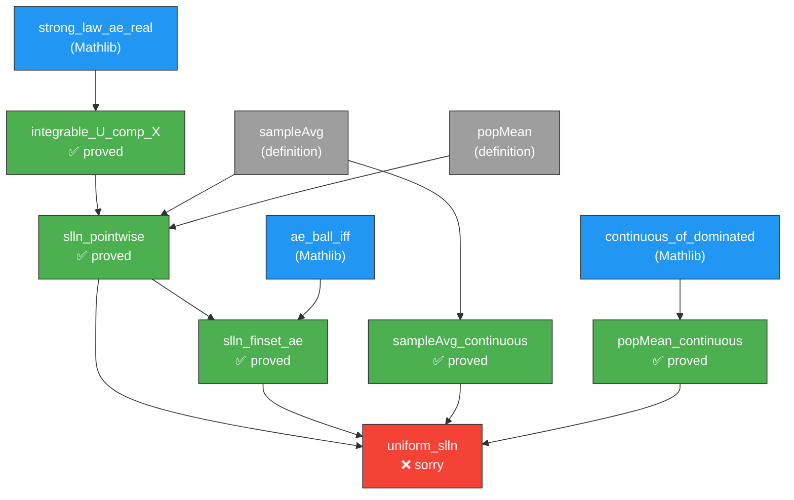
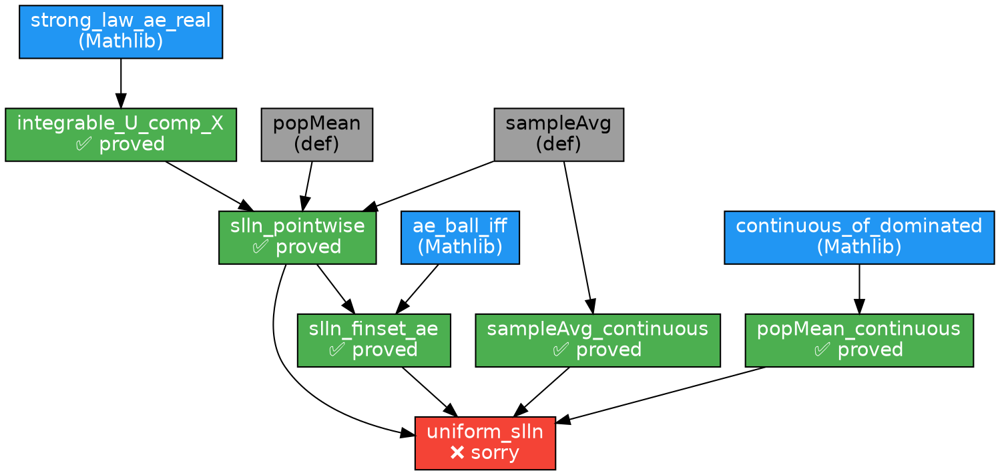

# USLLN Proof Dependency Graph

## Mermaid (for GitHub / Markdown rendering)



## ASCII (for terminal / comments)

```
Layer 0 (Mathlib):
  [strong_law_ae_real]  [continuous_of_dominated]  [ae_ball_iff]
         |                       |                      |
Layer 1 (Definitions):
  [sampleAvg]  [popMean]
         |          |
Layer 2 (Integrability):
  [integrable_U_comp_X] ✅
         |
Layer 3 (Pointwise SLLN):
  [slln_pointwise] ✅
         |
Layer 4 (Helpers):
  [slln_finset_ae] ✅    [sampleAvg_continuous] ✅    [popMean_continuous] ✅
         \                       |                      /
          \                      |                     /
Layer 5 (Main Theorem):
                      [uniform_slln] ❌
```

## DOT (for graphviz rendering)



## Statlib Eligibility

| Declaration | Sorry | Dependencies with sorry | Eligible for Verified? |
|-------------|-------|------------------------|----------------------|
| `sampleAvg` (def) | 0 | none | ✅ |
| `popMean` (def) | 0 | none | ✅ |
| `integrable_U_comp_X` | 0 | none | ✅ |
| `sampleAvg_continuous` | 0 | none | ✅ |
| `slln_pointwise` | 0 | none | ✅ |
| `slln_finset_ae` | 0 | `slln_pointwise` (clean) | ✅ |
| `popMean_continuous` | 0 | none | ✅ |
| `uniform_slln` | 1 | self | ❌ |

**Result: 7/8 declarations eligible for Verified library (all helpers proved).**
